# Lab 1.1 – Install Instana Server Manually

# Overview

Currently, there are quite some deployment patterns for Instana, which include:
   1. All-in-one single-VM setup
   2. Dual-VM setup
   3. Kubernetes for Instana components + single-VM for databases setup
   4. Kubernetes for Instana components + multi-VM for databases setup
   5. All-in Kubernetes

And this doc focuses on option #1, which is “1. All-in-one single-VM setup”, on Ubuntu.

**VM Specs**

The minimum VM specs are:
  - 12 vCPU
  - 48G RAM
  - 100G might be a good starting point (88G left after installation)

My VM on IBM Cloud: bx2-16x64 Balanced

I’d highly recommend to have 16 vCPU, 64G RAM, and 100+

Important Note - if the amount of CPUs or RAM is less than abovementioned specs, Instana CLI will stop you:

<picture>
  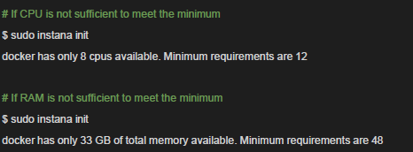
</picture>

**Architecture**

All components are containerized and deployed on Docker.

## 1. Access Instana-Server VM
```sh
ssh itzuser@<Instana Server ip address> -p 2223 -i <ssh key file>
```

## 2. Mount additional disk space
```sh
lsblk
```

<picture>
  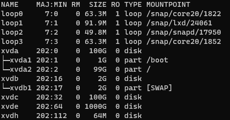
</picture>

```sh
sudo fdisk /dev/xvde
```

<picture>
  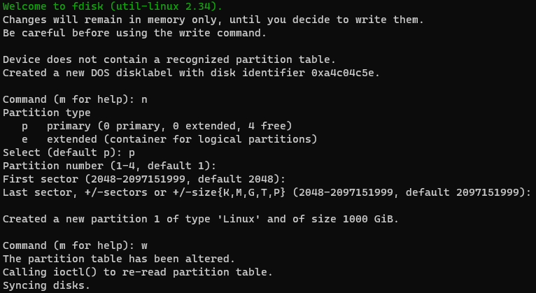
</picture>

```sh
sudo mkfs -t ext4 /dev/xvde1
```

<picture>
  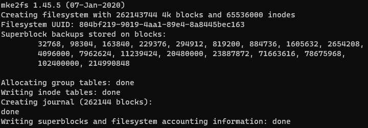
</picture>

```sh
sudo mount -t ext4 /dev/xvde1 /opt

vi /etc/fstab
     /dev/xvde1 /opt ext4 defaults,noatime 0 0

```
<picture>
  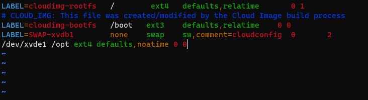
</picture>


## 3. Check Prerequisites

Let’s perform such prerequisite checks within the Instana Server VM.
 - Please make sure the server can connect to auth-infra.instana.io:443.
 - All installation and migration commands must be executed as root user, or a “normal user” with sudo permission.
 - Setup mount points and external volumes – note: all these mount points are configurable and should use a dedicated high performant SSD in production setup:
  /mnt/data – Data Stores
  /mnt/metrics – Metrics data
  /mnt/traces – Tracing data
  /var/log/instana – Logs

Test the connectivity
Make sure the netcat is installed

```sh
$ sudo apt-get install netcat
$ nc -vz auth-infra.instana.io 443
```

Mount or simply create some data folders for simplicity purposes
```sh
$ sudo mkdir /opt/{data,metrics,traces}
$ sudo mkdir /opt/log
$ sudo mkdir /opt/log/instana
```

TLS
```sh
$ sudo curl -sLO https://github.com/FiloSottile/mkcert/releases/download/v1.4.3/mkcert-v1.4.3-linux-amd64
$ sudo chmod +x mkcert-v1.4.3-linux-amd64 && sudo mv mkcert-v1.4.3-linux-amd64 /usr/local/bin/mkcert
```

Create a TLS key pair with <INSTANA SERVER IP>.nip.io as its CN
or skip this if you're going to use your key pair

> NOTE: PLEASE CHANGE TO YOUR IP

```sh
$ INSTANA_SERVER_IP=<Instana Server ip address> && \
  sudo mkcert -cert-file tls.crt -key-file tls.key "${INSTANA_SERVER_IP}.nip.io" "${INSTANA_SERVER_IP}"
```

NOTE : take note of the path to tls.crt (signed certificate file) and tls.key (private key file) 
        and the FQDN "${INSTANA_SERVER_IP}.nip.io"

## 4. Install Docker


Remove some legacy components, if any
```sh
$ sudo apt-get remove docker docker-engine docker.io containerd runc
```

It is O.K if you see "Unable to locate package docker-engine"

If there is a need to purge the previous failed Docker install
```sh
$ sudo apt-get purge docker-ce docker-ce-cli containerd.io
```

Update the apt package index and install packages to allow apt to use a repository over HTTPS:
```sh
sudo apt-get update
sudo apt-get install \
    ca-certificates \
    curl \
    gnupg
```

Add Docker’s official GPG key:
```sh
sudo mkdir -m 0755 -p /etc/apt/keyrings
curl -fsSL https://download.docker.com/linux/ubuntu/gpg | sudo gpg --dearmor -o /etc/apt/keyrings/docker.gpg
```

Use the following command to set up the repository:
```sh
echo \
  "deb [arch="$(dpkg --print-architecture)" signed-by=/etc/apt/keyrings/docker.gpg] https://download.docker.com/linux/ubuntu \
  "$(. /etc/os-release && echo "$VERSION_CODENAME")" stable" | \
  sudo tee /etc/apt/sources.list.d/docker.list > /dev/null
```

Update the apt package index:
```sh
sudo apt-get update
```

To install a specific version of Docker Engine, start by listing the available versions in the repository:
```sh
apt-cache madison docker-ce | awk '{ print $3 }'
```

Select the desired version and install:
```sh
VERSION_STRING=5:20.10.23~3-0~ubuntu-focal
sudo apt-get install docker-ce=$VERSION_STRING docker-ce-cli=$VERSION_STRING containerd.io docker-buildx-plugin docker-compose-plugin
```

Verify that the Docker Engine installation is successful by running the hello-world image:
```sh
sudo docker run hello-world
```

Moving /var/lib/docker to disk with more space
```sh
sudo systemctl stop docker
sudo mv /var/lib/docker /opt/docker
sudo ln -s /opt/docker /var/lib/docker
```

Start Docker daemon process
```sh
sudo systemctl enable docker
sudo systemctl start docker
```

Have a try for Docker
```sh
sudo docker run hello-world
```

Add current user into docker group so that we can run Docker cli without the need of sudo
```sh
sudo usermod -aG docker $USER
```

> Note: Please re-login to the VM to take effect.

## 5. Install Instana Server


As root, run the following commands:
```sh
sudo -i
echo "deb [arch=amd64] https://self-hosted.instana.io/apt generic main" > /etc/apt/sources.list.d/instana-product.list
wget -qO - "https://self-hosted.instana.io/signing_key.gpg" | apt-key add -
apt-get update
apt-get install instana-console
```

To avoid getting major updates during automated upgrades, run the following commands:
```sh
cat >/etc/apt/preferences.d/instana-console <<EOF
Package: instana-console
Pin: version 247-0-1
Pin-Priority: 1000
EOF
```
It’s a good practice to avoid getting major updates during automated upgrades, so we can have full flexibility and control for the major upgrades.
So let’s check the version we’re on now:

```sh
instana version
```

Finally, let’s kick off the Instana Server installation:
```sh
sudo instana init
```
It will be an interactive user experience, let’s go through it with the proper values, like this:

<picture>
  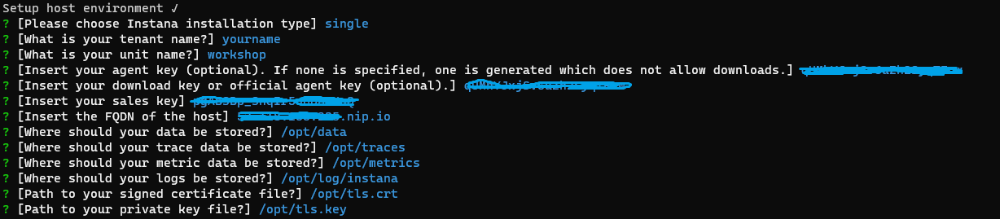
</picture>

After around 30 min, depending on your download speed as it will download all Instana’s Docker images and install them automatically. Instana is also a microservices-architecture based platform with quite some components.

<picture>
  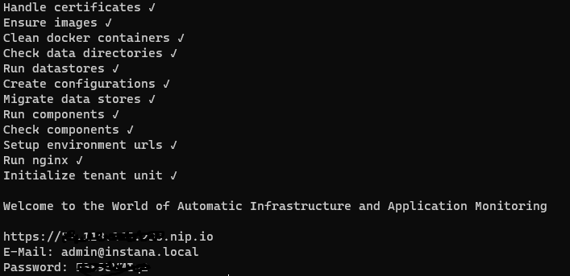
</picture>

## 6. First login

By following the info printed out once the installation is done, we can login to Instana:
Launch from browser: https://<Instana Server IP>.nip.io

<picture>
  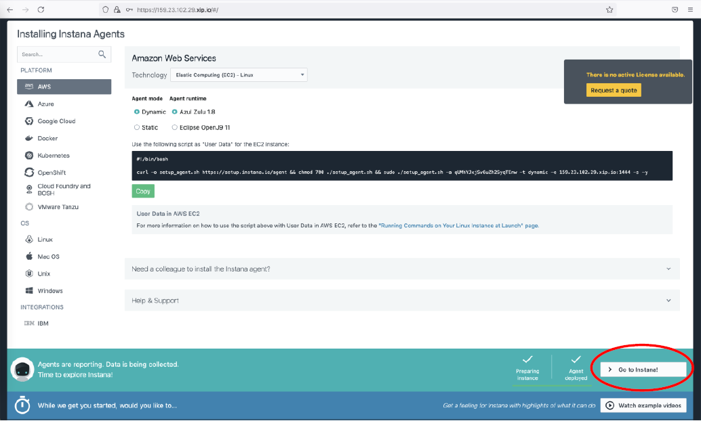
</picture>


Click “Go to instana!” button to start with the journey:


<picture>
  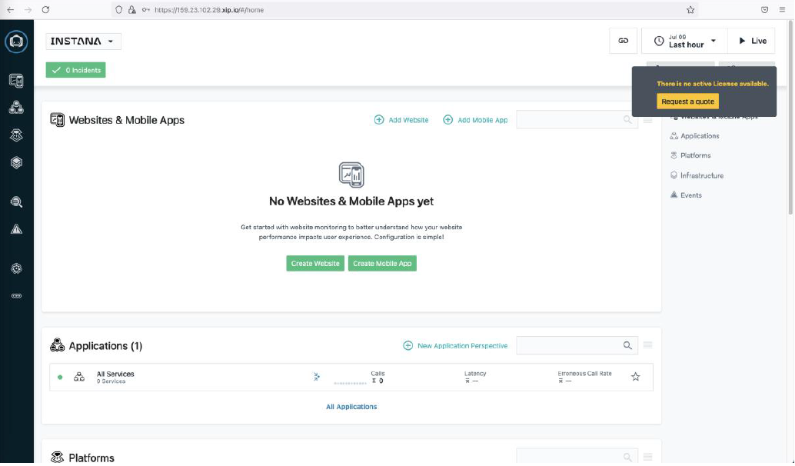
</picture>

## 7. License

# Download license
```sh
$ sudo instana license download
```

Now import it
```sh
$ sudo instana license import -f license
```

And verify it
```sh
$ sudo instana license verify
```

```sh
Output:

Verifying local license status ✓
Nr: 1
Valid from: 2022-09-22 00:00:00 +0000 UTC
Valid till: 2025-09-22 23:59:59.999 +0000 UTC
```

## 8. Post Actions

## 8.1 Install Agent for Instana

Who monitors the monitors?”
Well, we now have the answer in Instana: Instana monitors itself by its agent!

We recommend monitoring the health of your self-hosted Instana server with the use of an 
Instana agent running in Infrastructure-only mode. This will allow a number of health 
checks and metrics to be collected for your Instana server.


<picture>
  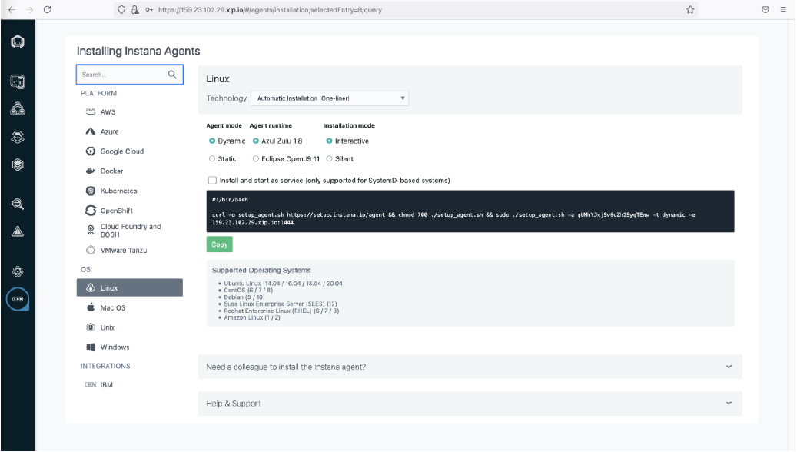
</picture>

<picture>
  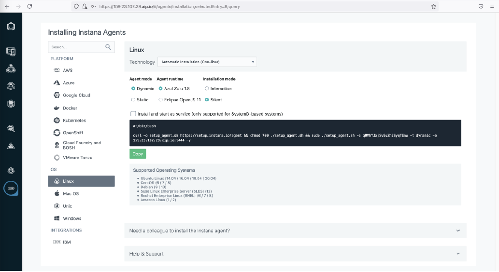
</picture>

Copy the one-liner command, paste into the console, with small manual update to enable the INFRA mode, 
by adding the -m infra part – note: the default will be APM mode which is not a desired 
mode for self-monitoring:

<picture>
  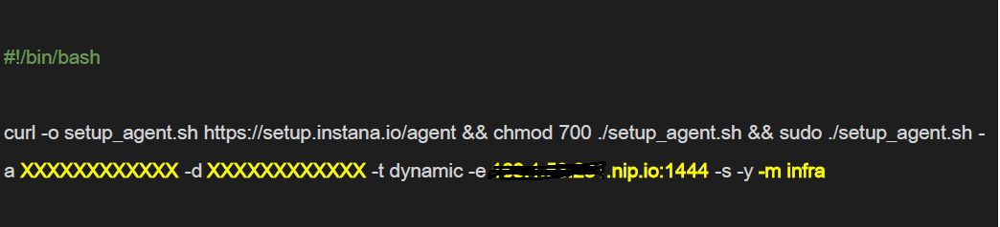
</picture>

The output might look like this:

<picture>
  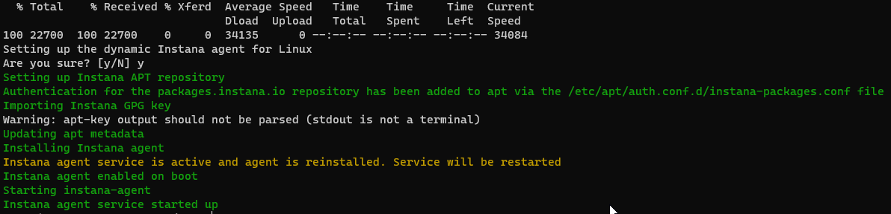
</picture>

The agent will be enabled, up and running by default. Or we can enable and start it manually, if not.
Have a check by using “systemctl” CLI:

```sh
$ sudo systemctl is-enabled instana-agent
```

Or we can enable and start it manually 
```sh
$ sudo systemctl enable instana-agent 
$ sudo systemctl start instana-agent 
$ sudo systemctl status instana-agent
```

## 8.2 Further Configure Agent


It’s a good practice to configure the zone info of the agent so that 
the host can be grouped properly within the Infrastructure View.
And I would consider having separated configuration files for specific 
custom configuration sections is a good practice too – these configuration 
files will be hot-reloaded by Instana agent without a need 
to restart the agent, which is super cool!

Configure zone
```sh
sudo touch /opt/instana/agent/etc/instana/configuration-zone.yaml
```

```sh
INSTANA_ZONE="InstanaServer" && \
cat <<EOF | sudo tee /opt/instana/agent/etc/instana/configuration-zone.yaml
# Hardware & Zone
com.instana.plugin.generic.hardware:
  enabled: true
  availability-zone: "${INSTANA_ZONE}"
EOF
```

(optional) Configure host, like tags
Do change them accordingly
```sh
sudo touch /opt/instana/agent/etc/instana/configuration-host.yaml
```

```sh
cat <<EOF | sudo tee /opt/instana/agent/etc/instana/configuration-host.yaml
# Host
com.instana.plugin.host:
  tags:
    - 'poc'
    - 'instana'
EOF
```

```sh
sudo instana update -f settings.hcl
```

If there is a need to uninstall agent
```sh
apt list --installed | grep instana-agent

sudo apt-get purge <package_name>
```

Set up the proper EUM endpoint which will proxy to the :2999 internal port
DO REPLACE IT WITH YOUR ENDPOINT!!!
Ref: https://www.ibm.com/docs/en/obi/current?topic=installer-configuring-end-user-monitoring
```sh
EUM_ENDPOINT="https://168.1.53.216.nip.io:446" && \
cat | sudo tee -a settings.hcl <<EOF
eum {
  tracking_base_url = "${EUM_ENDPOINT}/eum/"
}
EOF
```

## 8.3 Enhance the EUM settings

```sh
# By default, the code snippet generated from website monitoring might 
# be using the internal port, which is HTTP-based port 2999. For example:

<script> 
  (function(s,t,a,n){s[t]||(s[t]=a,n=s[a]=function(){n.q.push(arguments)}, 
  n.q=[],n.v=2,n.l=1*new Date)})(window,"InstanaEumObject","ineum"); 

  ineum('reportingUrl', 'http://168.1.53.231.nip.io:2999/'); 
  ineum('key', 'fjwzPxrwRO2ShJfRmPqOTA'); 
  ineum('trackSessions'); 
</script> 
<script defer crossorigin="anonymous" 
src="http://<Instana Server IP>.nip.io:2999/eum.min.js"></script>

# We should expose the ports proxied by embedded Nginx, so that they 
# could be further exposed by the enterprise’s load-balancer to become the final EUM endpoint(s):
#   - 446 for HTTPS, and
#   - 86 for HTTP
# So it’s like: enterprise load-balancer -> exposed 446/86 Instana ports -> 2999 internal port.
# This can be achieved by:

# Set up the proper EUM endpoint which will proxy to the :2999 internal port 
# DO REPLACE IT WITH YOUR ENDPOINT!!! 
# Ref: https://www.ibm.com/docs/en/obi/current?topic=installer-configuring-end-user-monitoring 
```

```sh
EUM_ENDPOINT="https://<Instana Server IP>.nip.io:446" && \ 
cat | sudo tee -a settings.hcl <<EOF 
eum { 
  tracking_base_url = "${EUM_ENDPOINT}/eum/" 
} 
EOF
```

```sh
# Then apply it
sudo instana update -f settings.hcl
```

```sh
# Once the update is complete, we can see the website configuration like this:

<script> 
  (function(s,t,a,n){s[t]||(s[t]=a,n=s[a]=function(){n.q.push(arguments)}, 
  n.q=[],n.v=2,n.l=1*new Date)})(window,"InstanaEumObject","ineum"); 
  ineum('reportingUrl', 'https://<Instana Server IP>.nip.io:446/eum/'); 
  ineum('key', 'fjwzPxrwRO2ShJfRmPqOTA'); 
  ineum('trackSessions'); 
</script> 
<script defer crossorigin="anonymous" 
src="https://<Instana Server IP>.nip.io:446/eum/eum.min.js"></script>

```

```sh
# if there is a need to reset password
instana configure admin -p <new password>
instana update -f settings.hcl

```

```sh
# if there a need to increase java heap size of agent
# on this folder /opt/instana/agent/bin there is a executable file called setenv
# you can modify the value below to give a higher heap size
# DEFAULT_AGENT_MAX_MEM='512m'
# DEFAULT_HEAP_MAX_MEM='160m'
```

