# Part 2. Core Capabilities & Use Cases

## Lab 2.1 – A Quick Tour

A good way to learn new things is to say “hello” to it, with a quick tour.

**Key Concepts**

Deployment pattern
Instana offers full flexibility in terms of deployment: SaaS, or on-prem.

Tenant Unit (TU)
Instana is designed for multi-tenancy. Each Instana installation supports multiple tenants with each tenant consisting of one or multiple tenant units (TU). Please note that multi-tenancy support is only available on SaaS or on-prem when deploying on Kubernetes / OpenShift.

Guided Tour
Instana provides a “guided tour” here: https://play-with.instana.io. Through it you can quickly walk Instana through too in your pace.

Goal
- To quickly walk through what functionalities Instana offers and how Instana organizes them
- To understand how Instana is designed from an end-user perspective

Steps
1. Landing page
The URL for “normal” tenant, other than those “special” ones like “play-with”,
will be structured like: https://<Tenant Unit>-<Tenant Instance>.instana.io

Once we’ve logged into it and we can see the landing page, where it’s the
default dashboard with below information:
- The list of “Websites & Mobile Apps”
- The list of “Application”
- The list of “Kubernetes” clusters
- The list of “Infrastructure”
- The list of “Events”

Please note though, the landing page of the “default” dashboard can be set to your custom dashboard too if you want, so you can have a landing page from that.

<picture>
  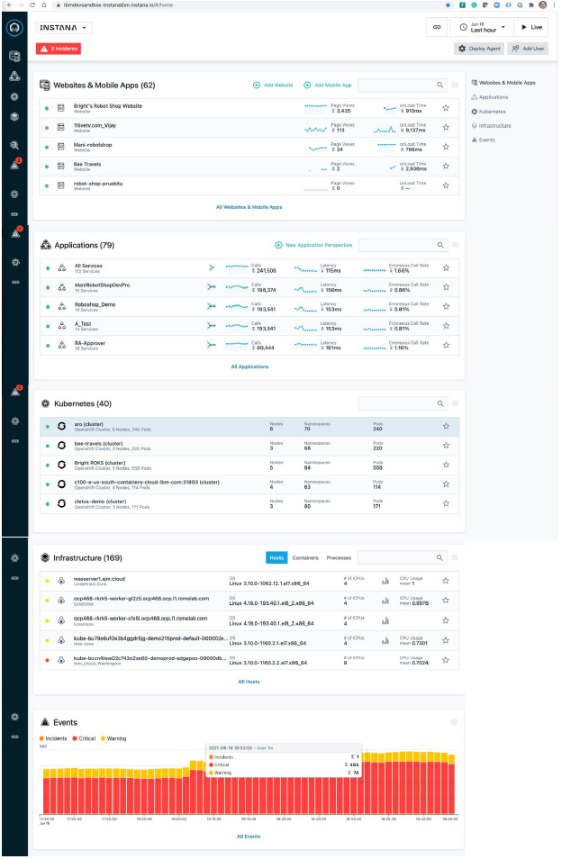
</picture>


2. Menu items

<picture>
  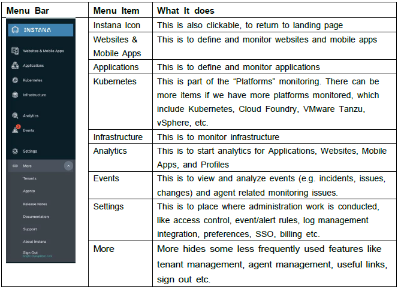
</picture>

3. Commonly shared components

Instana provides a consistent UX and there are some reusable components on different UIs.

<picture>
  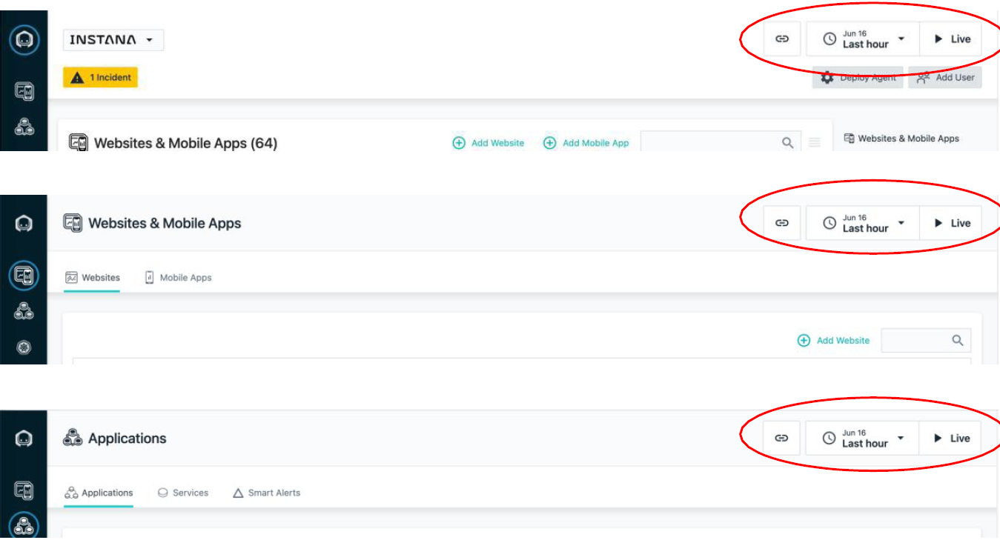
</picture>

Let’s go through some of them one by one:

<picture>
  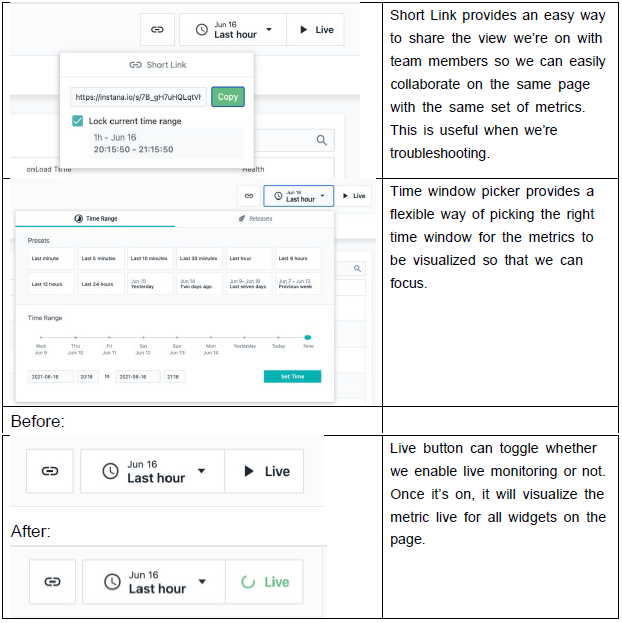
</picture>

**Takeaways**

As you could see from this lab, Instana provides a fine-grained, simplified and consistent user experience while offering highly integrated modern Application Performance Management (APM) features.

We will focus on its core capabilities to dive deeper throughout the labs, one by one.


# Lab 2.2 – Website Monitoring

Instana supports website monitoring by analyzing actual browser request times and route loading times. This allows detailed insights into the web browsing experience of end-users, as well as deep visibility into application call paths. The Instana website monitoring solution works by means of a lightweight JavaScript agent which is embedded into the monitored website.

**Key Concepts**

End-User Monitoring (EUM) or Real-User Monitoring (RUM)
Website monitoring, often called End-User Monitoring (EUM) or Real-User Monitoring (RUM), is an important tool to understand digital user experience.

Goal
- To understand how to enable monitoring for (microservices-based) website
- To walk through the built-in dashboards and metrics
- To understand the value of website monitoring

Steps

1. Start by defining a website on Instana

<picture>
  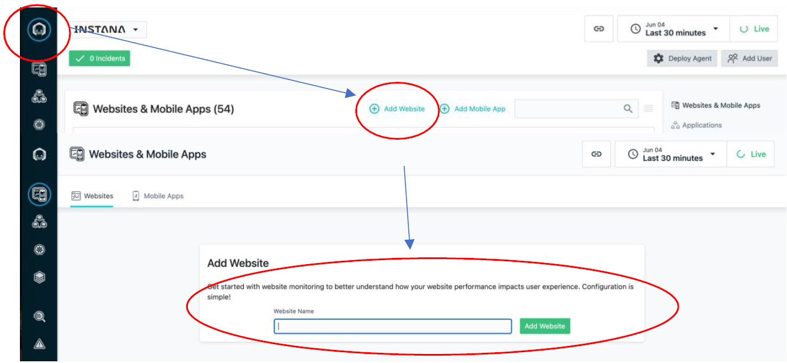
</picture>

Key in the website name, like “Student-{n} Robot Shop Website” is fine, where the {n} is the trainee’s identifier.
Now Instana will automatically generate some code snippet for us which can be easily embedded into our application.


<picture>
  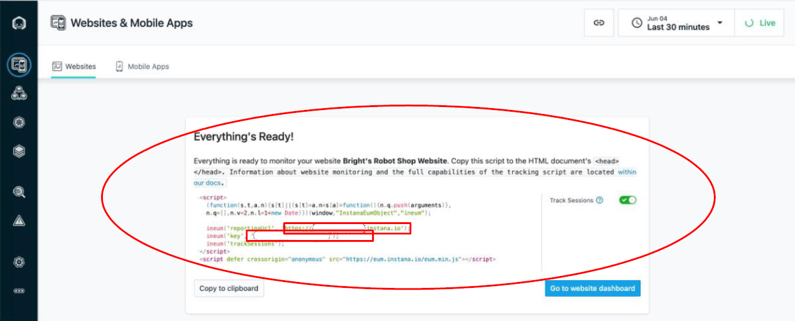
</picture>

Note:
  1. We can always check out this info within the website’s configuration anytime later.
  2. The are some important elements we will use, like the reporting URL and key.


## 2. Install Robot-Shop website

Well, a “website” is simply an application with customer-facing UI, which typically may include multiple services at the backend, with databases for data persistence.
Let’s use the Robot Shop app here, which is a “typical” cloud-native application built with different technologies. It’s maintained by Instana team and the OSS community.


### On Kubernetes (at the manage-to host)

Create the namespace
```sh
kubectl create namespace robot-shop
```

Clone the repo
```sh
git clone https://github.com/instana/robot-shop
```

Then cd into it
```sh
cd robot-shop
```

Deploy it by Helm 3
NOTE: Use the right values generated in website config as the variables
```sh
INSTANA_EUM_REPORTING_URL="https://<Instana Server IP>.nip.io:446/eum/" && \
INSTANA_EUM_KEY="xxxxxxxxxxxxxxxxx" && \
helm install robot-shop K8s/helm \
  --namespace robot-shop \
  --set image.version=2.1.0 \
  --set nodeport=true \
  --set eum.url="${INSTANA_EUM_REPORTING_URL}" \
  --set eum.key="${INSTANA_EUM_KEY}"
```

Note:
1. The “eum.url” and “eum.key” are set to the values generated by the previous step
2. If we updated something for the Helm Chart config, we can use “helm upgrade” with
the updated parameters to update the application.

Check out the pods deployed (wait 5-8 min)
```sh
kubectl get pod -n robot-shop
```

<picture>
  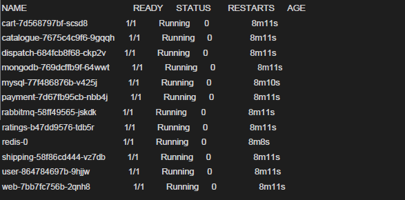
</picture>


Please note that if we use our exposed EUM endpoint at https://<IP>:446/eum/, 
instead of the internal endpoint at http://<IP>:2999, 
there is a small bug in the Robot Shop app around how to inject the “eum.url” at this line of code, when we expose the EUM endpoint at https://<URL>:<port>/eum/ - Stripping the ending slash will cause no data on EUM dashboard in this case:


<picture>
  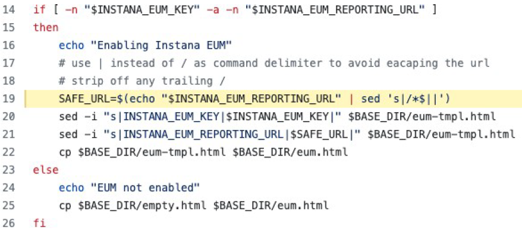
</picture>


To fix bug in Robot Shop
Firstly, log into the Web Pod:

```sh
kubectl exec -n robot-shop -it "`kubectl get pod -l service=web -n robot-shop -o jsonpath={..metadata.name}`"  -- bash
```

Then print out the eum.url injected eum.html file:

```sh
cat /usr/share/nginx/html/eum.html
```

The content will look like this:

<picture>
  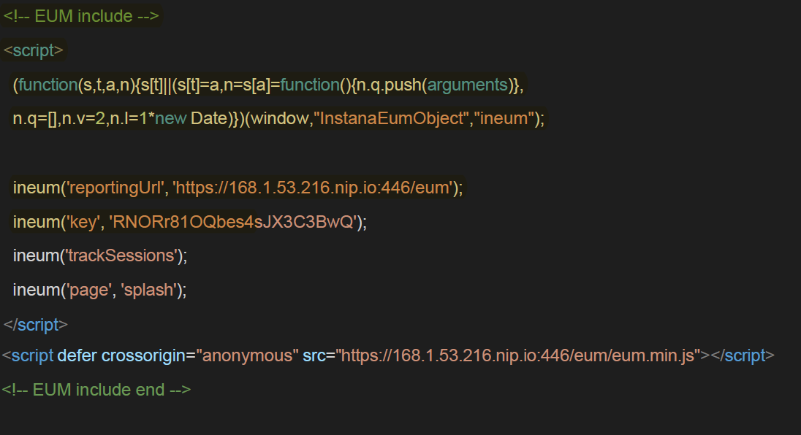
</picture>

Let’s copy the content and paste it into your editor of choice, 
and add the tailing “/” at the end of the 'reportingUrl', from:

```sh
From ineum('reportingUrl', 'https://<Instana Server IP>.nip.io:446/eum');
To ineum('reportingUrl', 'https://<Instana Server IP>.nip.io:446/eum/');
```

Then write it back to replace the original eum.html file. 
Please note that there is no “vi” in this Pod 
so we use “cat” command to write back the file:

```sh
cat > /usr/share/nginx/html/eum.html
```

Then copy and paste the updated content to the prompt, 
and then press “Control + c” and the file will be updated.
```sh
<!-- EUM include -->
<script> 
 (function(s,t,a,n){s[t]||(s[t]=a,n=s[a]=function(){n.q.push(arguments)}, 
 n.q=[],n.v=2,n.l=1*new Date)})(window,"InstanaEumObject","ineum");

 ineum('reportingUrl', 'https://<Instana Server IP>.nip.io:446/eum/'); 
 ineum('key', '<key>'); 
 ineum('trackSessions');
 ineum('page', 'splash');
</script>
<script defer crossorigin="anonymous" src="https://<Instana Server IP>.nip.io:446/eum/eum.min.js"></script>
<!-- EUM include end -->
```

You may have a final check by this command and make sure 
there is a ending slash in the 'reportingUrl'
```sh
cat /usr/share/nginx/html/eum.html
```

Please note that we actually don’t need to access the app directly from your browser, especially when you access your VM through another bastion VM. But if you want to expose the newly deployed application in “Kind”-powered cluster for external access, there are some ways (e.g. Ingress with dedicated ports declared while “kind” is provisioned, as documented in official docs here), but exposing it by using a “socat” might be the simplest way to achieve.


Expose the app if you want – this is optional for the lab
Open a terminal

Install socat
```sh
sudo apt-get update
sudo apt-get install socat
```
Get an IP address of the worker node
```sh
kubectl get node -o wide
```
Use any one of the worker node IP for node-ip.

```sh
kubectl get svc -n robot-shop
```

Get the nodeport for web service, node-port.
Open another terminal to run the following command. The terminal needs to be kept there if you want to browse the app.
```sh
socat TCP4-LISTEN:80,fork TCP4: <node-ip>:<node-port>

```

```sh
Now, you can access robotshop via http://<Manage To IP >
```

<picture>
  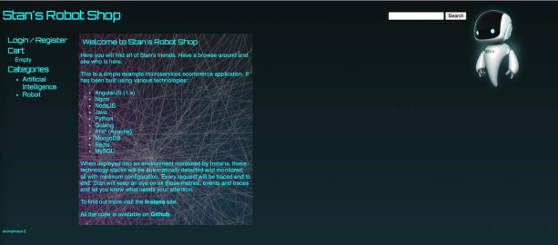
</picture>


## 3. Install the “load-gen” app

The Robot Shop repository comes with a handy load generation tool to keep accessing the website. We can install that to generate some traffic.

Deploy the load-gen App
```sh
kubectl -n robot-shop apply -f - <<EOF
apiVersion: apps/v1
kind: Deployment
metadata:
  name: load
  labels:
    service: load
spec:
  replicas: 1
  selector:
    matchLabels:
      service: load
  template:
    metadata:
      labels:
        service: load
    spec:
      containers:
      - name: load
        env:
          - name: HOST
            value: "http://web:8080/"
          - name: NUM_CLIENTS
            value: "5"
          - name: SILENT
            value: "1"
          - name: ERROR
            value: "0"                  # disable the error calls first
        image: robotshop/rs-load:latest
EOF
```
Bright Zheng created a new Selenium-based “load-gen”, here, which might generate better traffic for website monitoring as it can better simulate the human behaviours for website exploring with the EUM agent executed automatically.

For this lab, please deploy the Selenium-based “load-gen” as well, we can do this:

Deploy the Selenium-based EUM friendly load-gen
```sh
kubectl -n robot-shop apply -f - <<EOF
apiVersion: apps/v1
kind: Deployment
metadata:
  name: rs-website-load
  labels:
    service: rs-website-load
spec:
  replicas: 1
  selector:
    matchLabels:
      service: rs-website-load
  template:
    metadata:
      labels:
        service: rs-website-load
    spec:
      containers:
      - name: rs-website-load
        env:
          - name: HOST
            value: "http://web:8080/"
        image: brightzheng100/rs-website-load:2.1.0
        imagePullPolicy: Always
EOF
```

To stop the Selenium-based load, it can be scale down by:
```sh 
kubectl scale deployment rs-website-load -n robot-shop --replicas=0
```

## 4. Explore the website monitoring in Instana

Summary tab

<picture>
  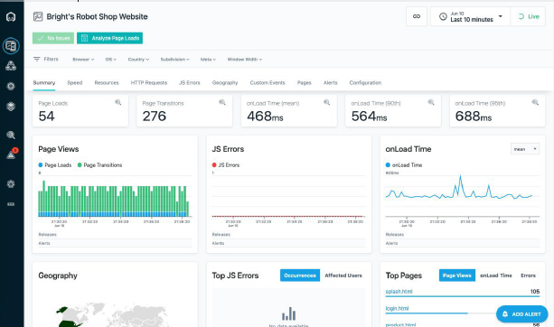
</picture>

Speed tab

<picture>
  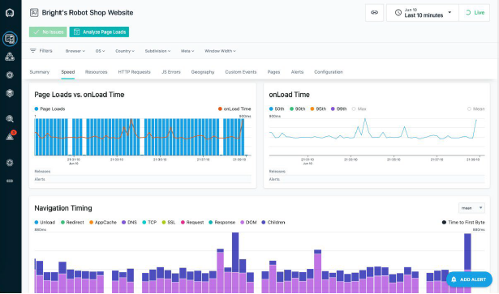
</picture>

Resources Tab

<picture>
  
</picture>

HTTP Requests tab

<picture>
  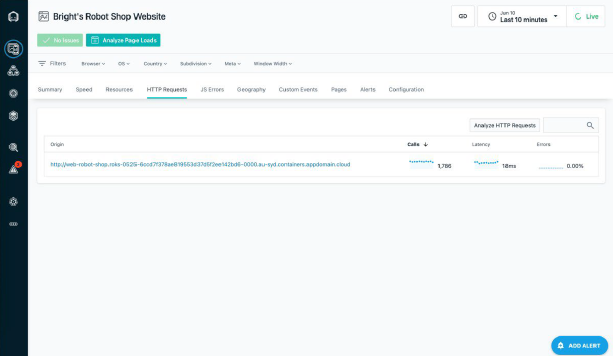
</picture>

JS Errors tab

<picture>
  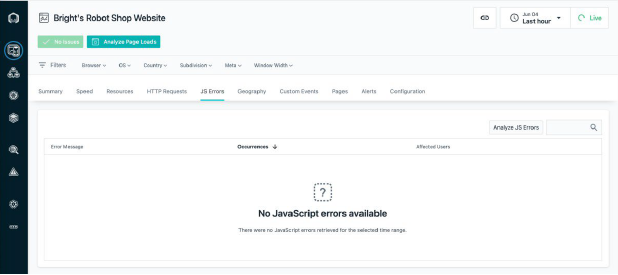
</picture>

Geography tab

<picture>
  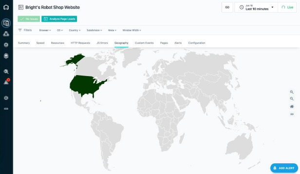
</picture>

Custom Events Tab

<picture>
  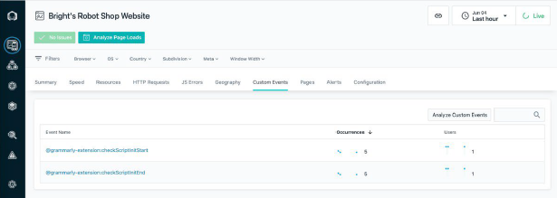
</picture>

Pages tab

<picture>
  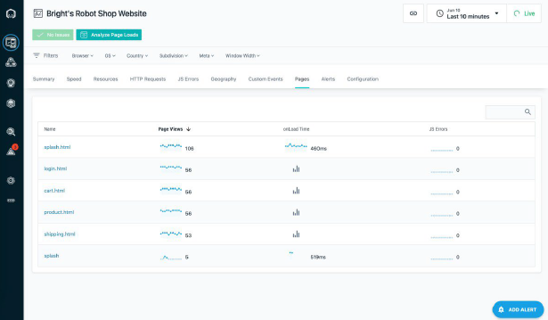
</picture>

Alerts tab

<picture>
  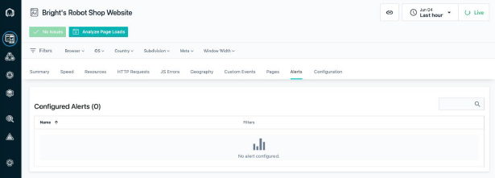
</picture>

Configuration tab

<picture>
  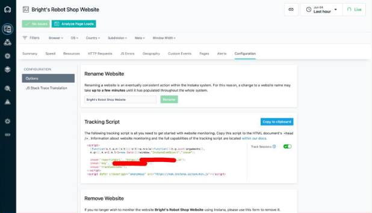
</picture>

**Takeaways**

As you could see from this lab, Instana can help us generate a handy code snippet with the fine-grained EUM JavaScript Agent embedded, which can be easily plugged into our app to make it instrumented.
The built-in website monitoring dashboard can be used to capture and visualize the metrics as the golden signals for our app SRE/operator to understand the website’s performance with a true End-User Monitoring (EUM) or Real-User Monitoring (RUM) experience.


# Lab 2.3 – Install & Manage Agents
Agent is the piece of software deployed into the monitored environment so that it can discover and collect the right monitoring data and send it back to Instana backend for further correlation and analytics for insights and actions.

**Key Concepts**

Instana has a powerful “one-agent” concept, which means that one agent discovers all supported technologies intelligently, activates the right sensor(s) to collect the right data, and sends it over to the backend. However, this
doesn’t mean one-size-fits-all. Instead, Instana offers some “higher” level of
agent types.

**Agent Types**

- Host Agents are agents installed into a Virtual Machine (VM), a physical host, Kubernetes, Cloud Foundry, VMware Tanzu and similar platforms.
- Cloud Service Agents are agents installed to monitor Cloud providers, like Amazon Relational Database Service (RDS) or Azure subscriptions.
- Serverless Agents are agents extend corresponding Cloud Service Agents for monitoring serverless – also known as Function-as-a-Service (FaaS) or Container-as-a-Service (CaaS) – platforms. As of now, AWS Fargate, AWS Lambda, Google Cloud Run are supported.
- Web and Mobile Agents are agents used for monitoring web sites and mobile applications.

**Goal**

1. To understand the agent types Instana provides for different monitor targets
2. To learn how to install agents on Kubernetes/OpenShift and Linux VM
3. To dive deeper into Instana’s Agent architecture, sensors and management

**Steps**

In general, Instana provides convenient mechanisms to generate installation scripts for all types of agents.

Click “Agents” -> “Installing Instana Agents” to start with:

<picture>
  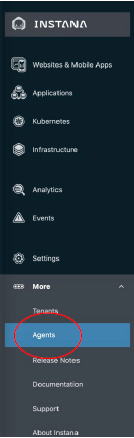
</picture>

<picture>
  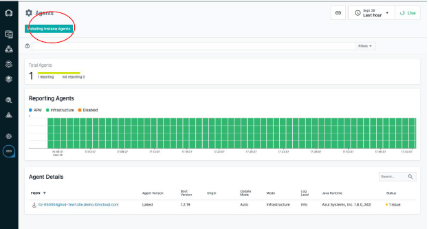
</picture>


## 1. Kubernetes agent – Generate installation scripts

Click “Kubernetes”, pick “Helm chart”, which is the default option, and key in:

- Cluster name: it’s a cluster name of the Kubernetes, e.g. “Student-{n}- Cluster” is fine, where {n} is the trainee’s identifier

- Agent zone: it’s a logical “zone” concept to group your resources in “Infrastructure” view, e.g. “Student-{n}-Zone” is fine, where {n} is the trainee’s identifier – please pick a meaningful name for the zone.

<picture>
  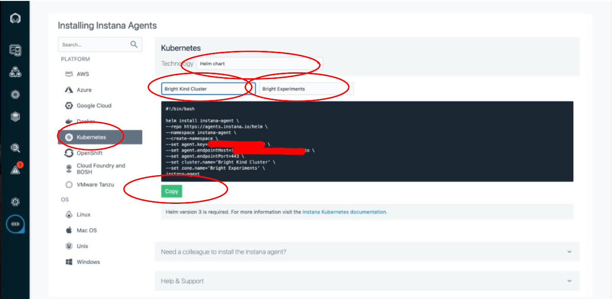
</picture>

And then click the “Copy” button to copy the generated script to clipboard.

## 2. Kubernetes agent – Install agent

We now can paste the copied script on the console of our Host VM and run it. The script should look like this – do remember to use your generated script!

Make sure we’ve logged into Kubernetes with admin role 
Then past YOUR copied script to install the agent

```sh
helm install instana-agent \
  --repo https://agents.instana.io/helm \ 
  --namespace instana-agent \ 
  --create-namespace \ 
  --set agent.key=xxxxxxxxxxxxxxxxxx \ 
  --set agent.downloadKey=xxxxxxxxxxxxxxxxxx \ 
  --set agent.endpointHost=<Instana Server IP>.nip.io \ 
  --set agent.endpointPort=1444 \ 
  --set cluster.name='Student-1-Cluster' \ 
  --set zone.name='Student-1-Zone' \ 
  instana-agent
```
Note:
  - By default, the Helm command will create a namespace named “instana-agent”.
  - If you’re installing the agent for OpenShift, not Kubernetes, there is another dedicated entry, but the Helm command is quite similar.

If proxy is required to access the backend and the repository of agent sensors, configure below environment variables and set them with “--set key=value” format:

```sh
agent.proxyHost      Hostname/address of a proxy
agent.proxyPort      Port of a proxy
agent.proxyProtocol  Proxy protocol. Supported proxy types are http (for both HTTP and HTTPS proxies), socks4, socks5.
agent.proxyUser      Username of the proxy auth
agent.proxyPassword  Password of the proxy auth
agent.proxyUseDNS    Boolean if proxy also does DNS
```

After a few (1-2) minutes, we should be able to see the pods running, which are derived from a DaemonSet:

Soon, we can see the pods of the DaemonSet are deployed

```sh
kubectl get pod -n instana-agent
```
<picture>
  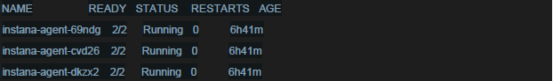
</picture>

## 3. skip 

## 4. skip

## 5. Linux VM agent – Generate agent installation script

It’s also very common to monitor VMs, and the software (e.g. middleware, databases, apps) and the processes inside.
To do that, we can generate the one-liner installation script from Instana UI too. Check the “Silent” option to install agent without a prompt.

<picture>
  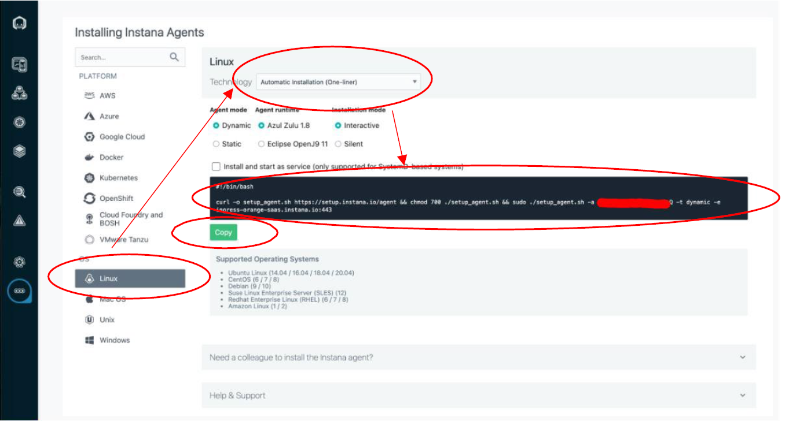
</picture>

## 6. Linux VM agent – Install agent

There is a list of supported Linux distros and versions:
- Supported operating systems
- Ubuntu Linux 14.04 (trusty)
- Ubuntu Linux 16.04 (xenial)
- Ubuntu Linux 18.04 (beaver)
- Ubuntu Linux 20.04 (focal)
- CentOS 6 1
- CentOS 7
- CentOS 8
- Debian 9 (stretch)
- Debian 10 (buster)
- Suse Linux Enterprise Server (SLES) 12 2
- Redhat Enterprise Linux (RHEL) 6 1
- Redhat Enterprise Linux (RHEL) 7
- Redhat Enterprise Linux (RHEL) 8
- Amazon Linux 1
- Amazon Linux 2

In the labs, we’ve used footloose to create 2 “VMs” running as containers: one is Ubuntu 18.04 and the other is Centos 7.

Here we use the Ubuntu VM as example, but please feel free to try both. SSH into the VM and run it:

Run this in the Host VM:


cd to the home folder
```sh
cd ~
```

List out the footloose-powered VMs we have
```sh
footloose show -c footloose.yaml
```
<picture>
  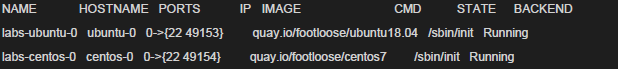
</picture>


Log into the Ubuntu VM
```sh
footloose ssh root@ubuntu-0 -c footloose.yaml
```

Run this within the logged-in Ubuntu VM – do remember to use your generated script!

Once SSH'ed into the Ubuntu "VM" powered by `footloose`:

Install some required software components before agent installation
```sh
apt-get update
apt-get install gpg apt-utils -y
```
Paste YOUR generated one-liner installation script and run it
```sh
curl -o setup_agent.sh https://setup.instana.io/agent && chmod 700 ./setup_agent.sh && sudo ./setup_agent.sh -a xxxxxxxxxxxxxxxxxx -d xxxxxxxxxxxxxxxxxx -t dynamic -e <Instana Server IP>.nip.io:1444 -y 
```

## 7. Linux VM agent – Configure agent
By default, the agent is not up and running after installation
```sh
root@ubuntu-0:~# systemctl status instana-agent
```

If needed to uninstall the agent
```sh
apt list --installed | grep instana-agent
sudo apt-get purge <package_name>
```

It’s actually ready to start but having some initial configuration might be a good idea. For example, let’s set the Zone as the same as our Kubernetes/OpenShift’s – Do remember to replace INSTANA_ZONE="<YOUR ZONE NAME>" with your preferred Zone name.

Configure Zone
```sh
touch /opt/instana/agent/etc/instana/configuration-zone.yaml 
INSTANA_ZONE="Student-1-Zone" && \
cat <<EOF | sudo tee /opt/instana/agent/etc/instana/configuration-zone.yaml
# Hardware & Zone
com.instana.plugin.generic.hardware:
  enabled: true
  availability-zone: "${INSTANA_ZONE}" 
EOF
```

Configure host, like tags
```sh
touch /opt/instana/agent/etc/instana/configuration-host.yaml
cat <<EOF | sudo tee /opt/instana/agent/etc/instana/configuration-host.yaml 
# Host
com.instana.plugin.host: 
  tags:
    - 'labs'
    - 'poc'
    - 'instana'
EOF
```

## 8. Linux VM agent – Enable and Start Agent
Start it up
```sh
systemctl start instana-agent
```

We can trace the logs by journalctl CLI
```sh
journalctl -flu instana-agent
```

Note: you may install some software even after the agent is installed and configured. The agent will be smart enough to discover and collect the right monitoring data, thanks to the sensors, for all supported technologies. For example, you may install apache, and/or MySQL there.

Install & Start apache2

```sh
apt-get install -y apache2 
systemctl start apache2
```

Install Agent in the Centos VM.

Log into the Centos VM
```sh
footloose ssh root@centos-0 -c footloose.yaml
```

There is missing command in Centos and need to install.
```sh
yum install which
```
Install the agent.
```sh
curl -o setup_agent.sh https://setup.instana.io/agent && chmod 700 ./setup_agent.sh && sudo ./setup_agent.sh -a xxxxxxxxxxxxxxxxxx -d xxxxxxxxxxxxxxxxxx -t dynamic -e <Isntana Server IP>.nip.io:1444 -y
```

Configure zone
```sh
touch /opt/instana/agent/etc/instana/configuration-zone.yaml
INSTANA_ZONE="Student-1-Zone" && \
cat <<EOF | sudo tee /opt/instana/agent/etc/instana/configuration-zone.yaml
# Hardware & Zone
com.instana.plugin.generic.hardware:
  enabled: true
  availability-zone: "${INSTANA_ZONE}"
EOF
```

(optional) Configure host, like tags
Do change them accordingly
```sh
touch /opt/instana/agent/etc/instana/configuration-host.yaml
cat <<EOF | sudo tee /opt/instana/agent/etc/instana/configuration-host.yaml
# Host
com.instana.plugin.host:
  tags:
    - 'labs'
    - 'poc'
    - 'instana'
EOF
```

Start it up
```sh
systemctl enable instana-agent
systemctl start instana-agent
```

We can trace the logs too
```sh
journalctl -flu instana-agent
```

## 9. View them in the infrastructure view


<picture>
  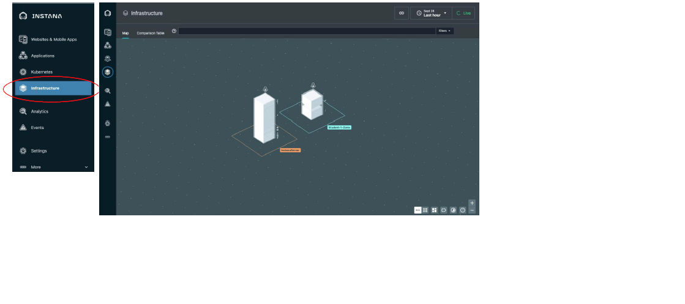
</picture>

Within this very cool Infrastructure View, we can “query” things with a very
simple lucene query syntax.
For example, we can simply key in “Student” in the filter box and it will
show only something match the keyword, which is a zone:

<picture>
  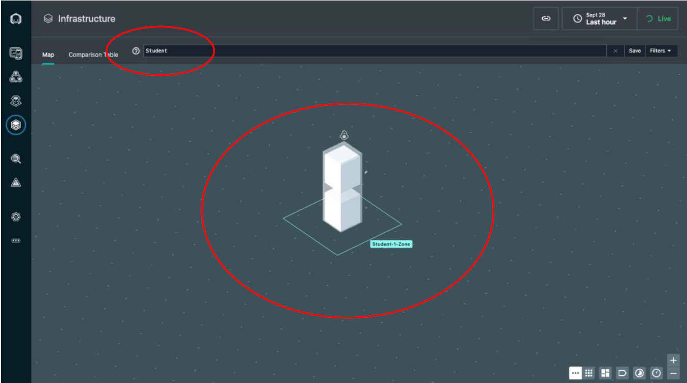
</picture>

And we can use “advanced” filters too, like “entity.zone:"Student*" *and “entity.type:httpd” so that we can precisely locate/query desired objects within our IT landscape:

<picture>
  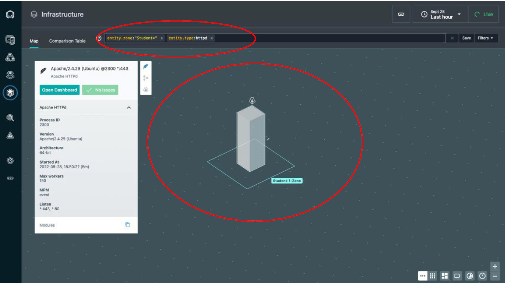
</picture>

Furthermore, you can save some useful filters too so that you can reuse it in the future, anytime.

<picture>
  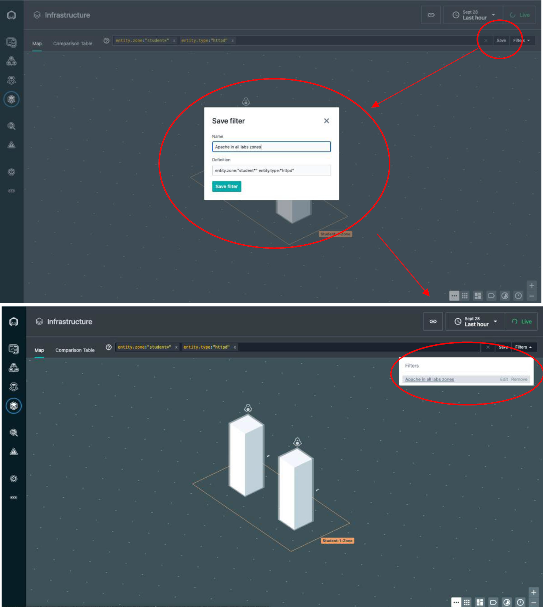
</picture>

## 10. Search the agents by our Zone’s keyword

Click “More” -> “Agents”, we can see all agents deployed.

<picture>
  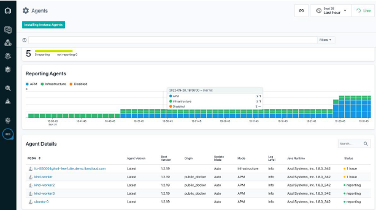
</picture>

And you may use the same mechanism/syntax to filter agents too. For
example, try typing “Student”.

<picture>
  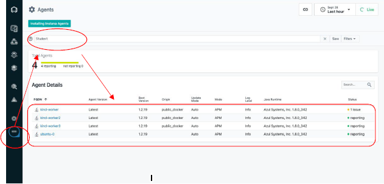
</picture>

## 11. Dive deeper into the agent

Let’s filter and click the ubuntu0 agent – well, actually any agent is fine:

<picture>
  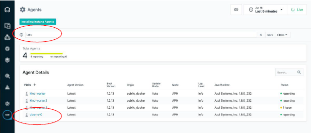
</picture>

There are 3 Agent modes: Disabled, Infrastructure and APM. APM is the default.


<picture>
  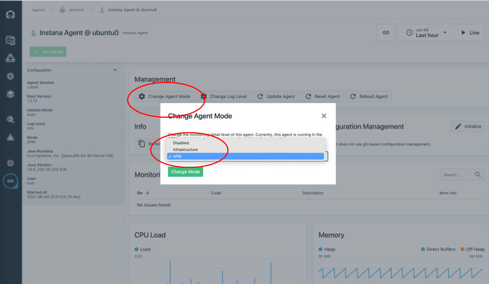
</picture>

There are two log levels for agent: INFO, DEBUG. Default is INFO.


<picture>
  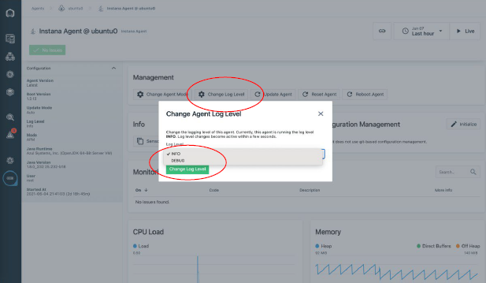
</picture>

We also can update, reset, and reboot the agent from Instana UI.

<picture>
  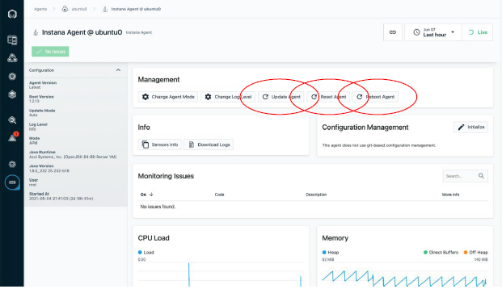
</picture>

Sensors are the “plugin”s within the one-agent design of Instana Agent, and there are hundreds of supported sensors for the supported technologies and they’re growing along the days:


<picture>
  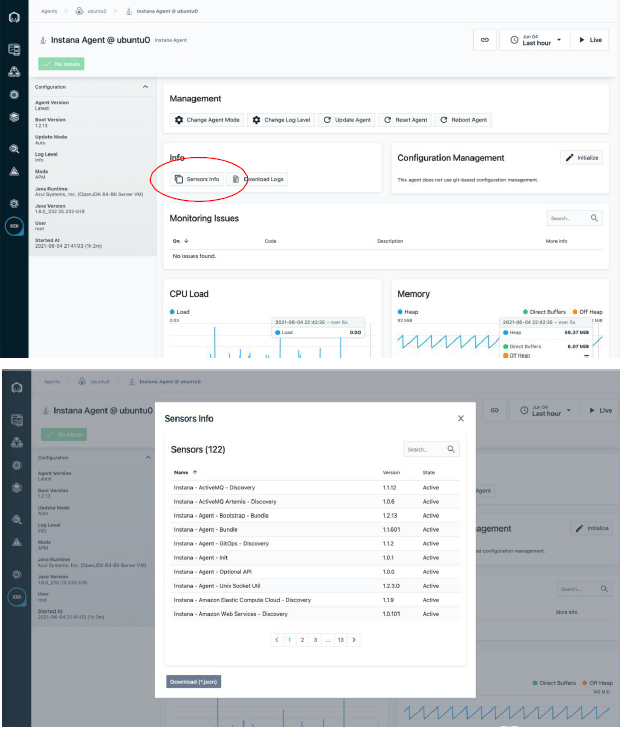
</picture>

Instana provides Git-based configuration management, aka GitOps, experience too by simply specifying the remote Git repo. How this Git repo should look like? Have a look at this extremely simple Git repo sample: https://github.com/brightzheng100/instana-gitops-sample. Or check out this official doc namely “Git-based configuration management” for details.


<picture>
  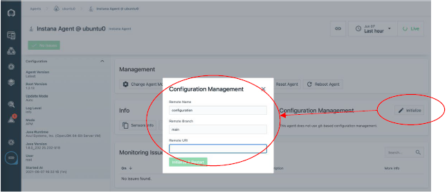
</picture>

Instana also provides rich feature for agent’s self-monitoring, with logs:

<picture>
  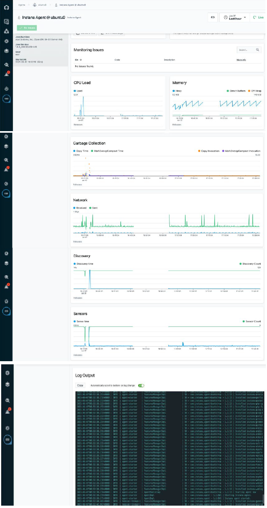
</picture>

**Takeaways**
As you could see from this lab, Instana helps SRE/operator generate the agent installation script with a similar one-liner experience, which removes the pain while rolling out to more and more VMs, Kubernetes clusters and/or other supported platforms. Don’t forget, there is always a way to automate the installation by using IT automation tools like Ansible, Puppet, or Chef, or anything you prefer.

Bright Zheng has co-authored an article, with a Red Hatter in APAC region, to cover the synergy between Instana and Ansible, do check it out too to see how real world use cases can be easily addressed: https://developer.ibm.com/articles/automation-powered-aiops/

And the powerful architecture of one-agent, with the huge ecosystem of the sensors for hundreds of supported technologies brings in intelligent discovery for any potential technologies we adopt along the way, without a need to re- configure from time to time, which dramatically reduces the operational effort. You may check out this doc for currently supported technologies: https://www.instana.com/docs/ecosystem/

The out-of-the-box integration of Git repo enables us to embrace GitOps for a better day 2 configuration management experience.

# Lab 2.4 – Application Monitoring

**Key Concepts**

**Application**
An application for APM tools is a static set of code runtimes (e.g. JVM or CLR) that are monitored using an agent. Normally the application is defined as a configuration parameter on each agent.
Instana introduces the next generation of APM with its application hierarchy of services, endpoints, and application perspectives across them. The main goal is to simplify the monitoring of your business' service quality. Based on the data Instana collects from traces and component sensors, we discover your application landscape directly from the services actually being implemented.

**Application Perspectives**
Application perspectives enable you to tailor your view of an application and to capture the type of semantics and information you need to optimize the applications and services you are responsible for. An application perspective represents a set of services and endpoints that are defined by a shared context and is declared using tags.

**Goal**
1. To understand how to define an application in Instana
2. To walk through the built-in dashboards and metrics

**Steps**
1. Create Application Perspectives (AP) through the wizard

Click the Instana icon at the top left to start – or simply click the
“Application” menu item to jump into applications directly:

Follow by Click “New Application Perspective” under “Applications” section:

<picture>
  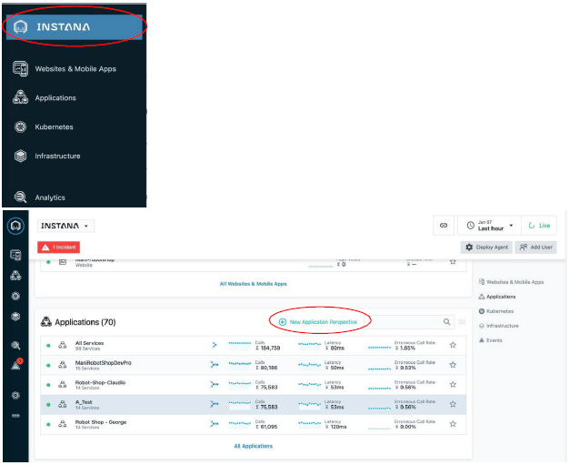
</picture>

Step 1: Select Model, or Blueprint

There is a list of models/blueprints:
- Services or Endpoints: The simplest way to construct an AP is by selecting the collection of services or endpoints directly.
- A Critical User Journey: Similar to the blueprint above but with defaults for use with the SLI / SLO capability. This blueprint will be enhanced in the future for deeper SLI / SLO integration.
- Environment or Region: Selecting the services based on an environment (e.g., production or staging that may be described by the agent.zone tag) or region (eg. US East).
- An Important Customer or Tenant: By leveraging custom tags or HTTP parameter information, an AP can be constructed for your important customer or tenant.
- Kubernetes or Container: A platform oriented way to specify the collection of services that form an AP.
- Request Attributes: An AP based on request attributes (eg. HTTP headers, query parameters).
- Technology: A group of services based on a technology (eg. MySQL, all databases) or application name.
- Custom Tags: You can add your own meta-data as a custom tag via the SDK and the custom tag data specifies the collection of services or endpoints.

<picture>
  
</picture>

Let’s try “Kubernetes or Container” since we’ve installed the agent for our
Kubernetes / OpenShift cluster, and click “Next”:

<picture>
  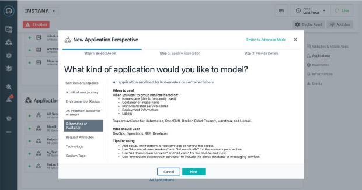
</picture>

Step 2: Specify Application

Click the “Add filter”, we can add two filters:
- Agent Zone = “<YOUR INSTANA ZONE>” – replace it with your Zone name
- Kubernetes Namespace = “robot-shop”

<picture>
  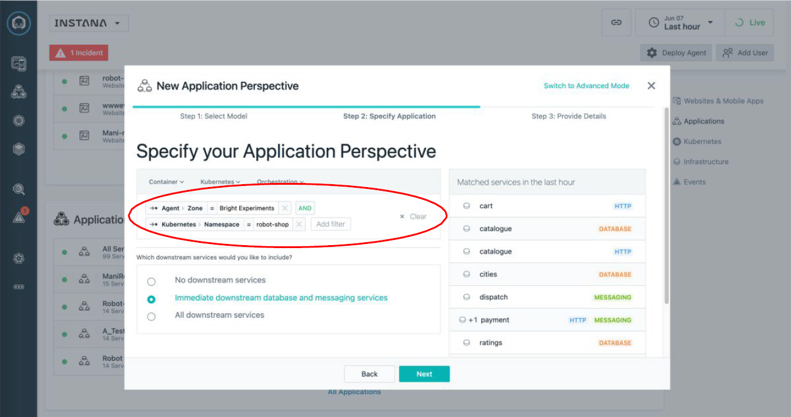
</picture>

Step 3: Provide Details
Let’s name it something like “Student-{n} Robot Shop App” and click “Create” button.

<picture>
  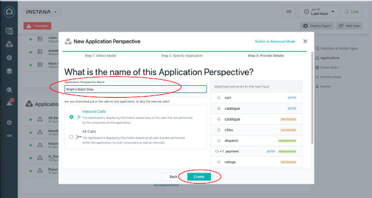
</picture>

It will be automatically redirected to the Application view of our newly
created application “Robot Shop”:

<picture>
  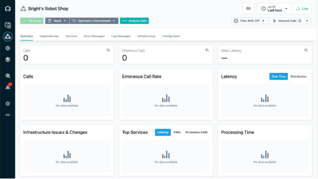
</picture>

Click the “Live” button to allow displaying dashboard live, and we can see metrics filling up the dashboard automatically within 1 minutes.

<picture>
  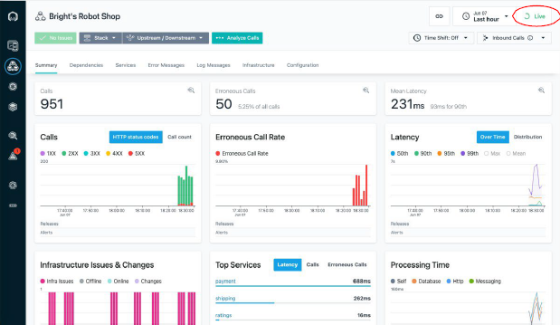
</picture>

2. Explore the application dashboard

General

At the op, there is a Time Range selection, by default it’s “Last Hour”
moving window.

<picture>
  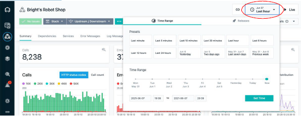
</picture>

We can easily switch to “Live” mode which means we’re using the live
metrics rendering the dashboard:

Once clicked, it will become green with a refreshing animation:
<picture>
  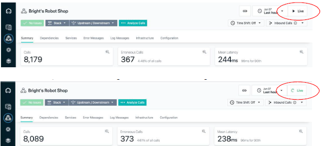
</picture>

Time Shift is to overlay last time window to have a better view of answering
“what happened before” and “what’s the baseline to compare”:

<picture>
  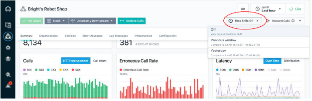
</picture>

Once enabled by clicking say “Previous window”, we can see the difference
from some interesting areas:

<picture>
  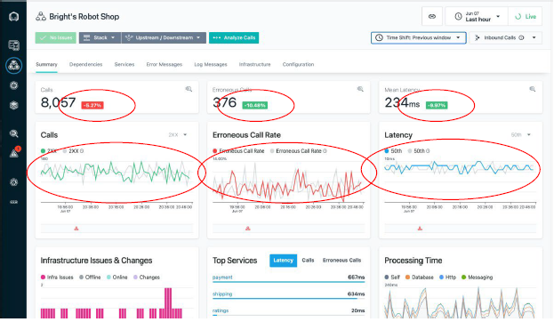
</picture>

Stack offers an Application-centric contextual view for the related services, endpoints.

<picture>
  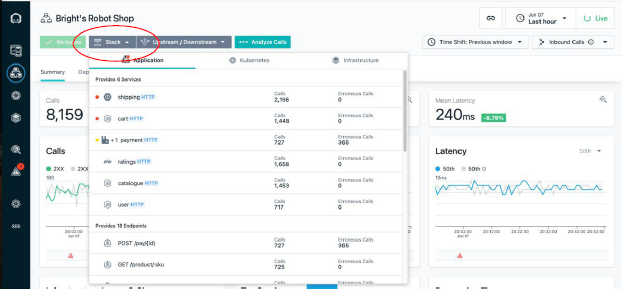
</picture>

If the Application is related to OpenShift / Kubernetes, the “Kubernetes” tab offers more info about the cluster, nodes, namespaces, deployments, pods etc., so we can easily navigate through the relevant objects.

<picture>
  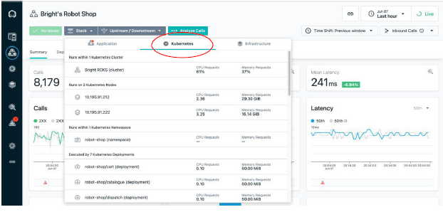
</picture>

Infrastructure providers Zone, host, processes, runtimes etc., infra level information that is related to current application.

<picture>
  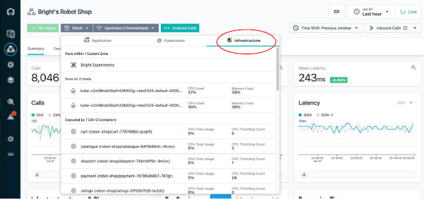
</picture>

The “Analyze Calls” button provides a convenient entry to analyze, for calls.

<picture>
  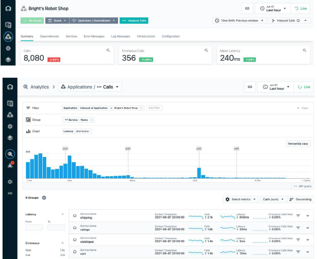
</picture>

Summary

Summary tab is the default view of application where a series of “golden”
signals are highlighted.

<picture>
  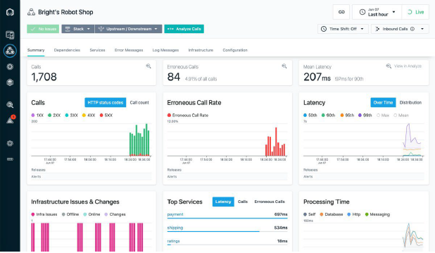
</picture>

Dependencies
Dependencies tab shows the discovered topology view for the services to illustrate how they interact with each other.

<picture>
  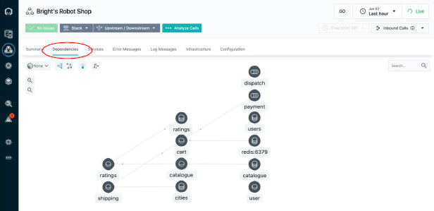
</picture>

We can enlarge the specific services icons by incoming calls, erroneous rate, or latency too:

<picture>
  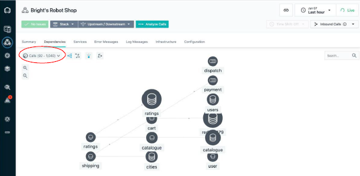
</picture>

Services
Services tab focuses on the discovered services:

<picture>
  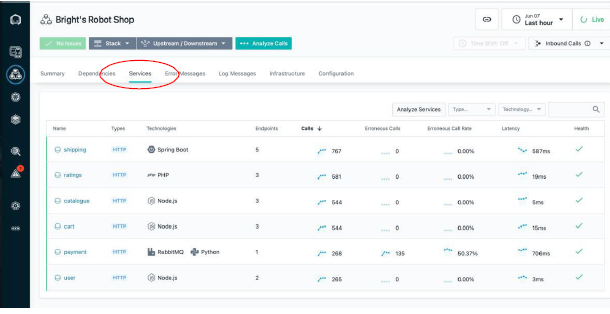
</picture>

Error Messages
Error Messages tab highlights the error messages, collected from tracing, for easier troubleshooting:

<picture>
  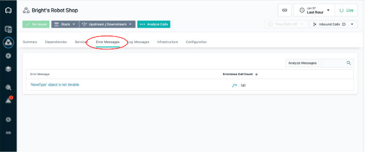
</picture>

Log Messages
Log Messages tab highlights the log messages with WARN or higher criticality level, automatically instrumented and collected from tracing:

<picture>
  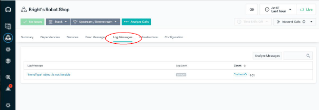
</picture>

Infrastructure
Infrastructure tab lists down the corresponding infrastructure component shown on the Infrastructure Monitoring view.

<picture>
  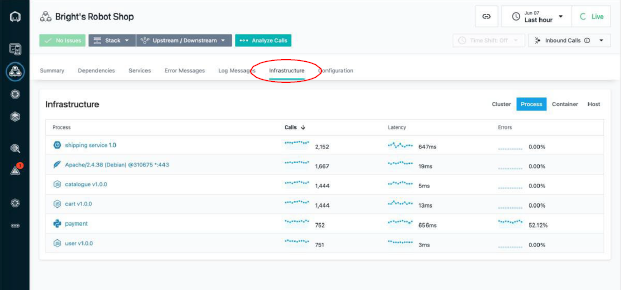
</picture>

Configuration
Configuration tab shows the info how we configured the AP. We can further enhance or edit from here.

<picture>
  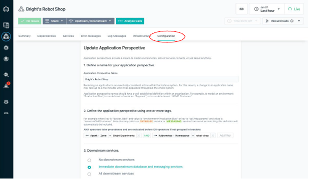
</picture>

**Takeaways**

As you could see from this lab, Instana’s Application Perspective (AP) is a powerful tool for monitoring, alerting, and analysis of a microservices environment. Each AP auto-generates a feature rich monitoring dashboard for the golden signals and more. It’s well organized so that a team can stay focused on the services they are interested in and aren’t distracted. Alerts, errors, and logs are scoped to an AP to focus the troubleshooting.
An Application Perspective achieves this by enabling you to dynamically
scope the visibility to “just the right” size to meet your needs, such as:
- by specifying a sub-set of services along with their dependencies;
- by zone or cluster;
- by technology;
- by business transaction or user journey;
- by deployment engine;
- by version or release;
- or any combination.


# Lab2.5 – Infrastructure Monitoring

**Key Concepts**
**Infrastructure**

Infrastructure - physical, virtual, cloud, hybrid, containerized - is the underlying layer to provide the relevant resources and services for applications.

**Goal**

Sometimes, especially in cloud-native world, the line between infrastructure and apps can be blur and the responsibility can be slightly shifted.
For example, is a container that runs our app the infrastructure? How about the middleware running in that container? Remember, the containers are typically packaged by developers or CI/CD pipelines.

The goal of this lab is:
- To understand the value of providing the infrastructure view
- To understand how Instana brings in a holistic view for different layers of technologies being monitored

**Steps**

1. Infrastructure Map

Click “Infrastructure” menu item, the default view of infrastructure is the Infrastructure Map, where shows us a bird-eye view of all the monitored infrastructure objects, grouped by Zones – for those infrastructure elements that don’t have a zone will be grouped by a zone named “Undefined Zone”.

<picture>
  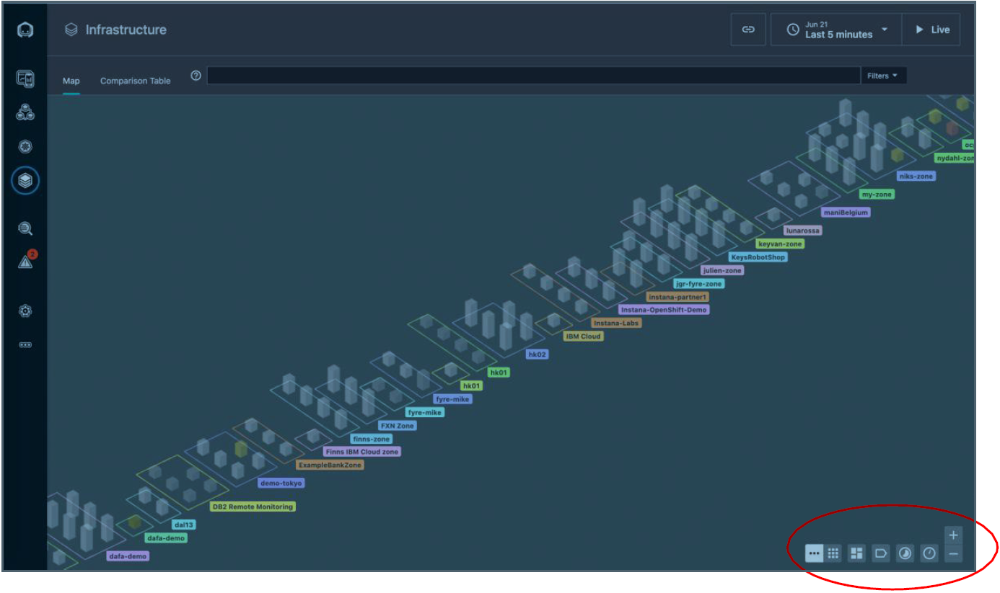
</picture>

The default layout of Infrastructure Map is “zones by name”, and there are
different ways to rearrange the view.
For example, clicking the second button namely can rearrange zones as a compact structure:

<picture>
  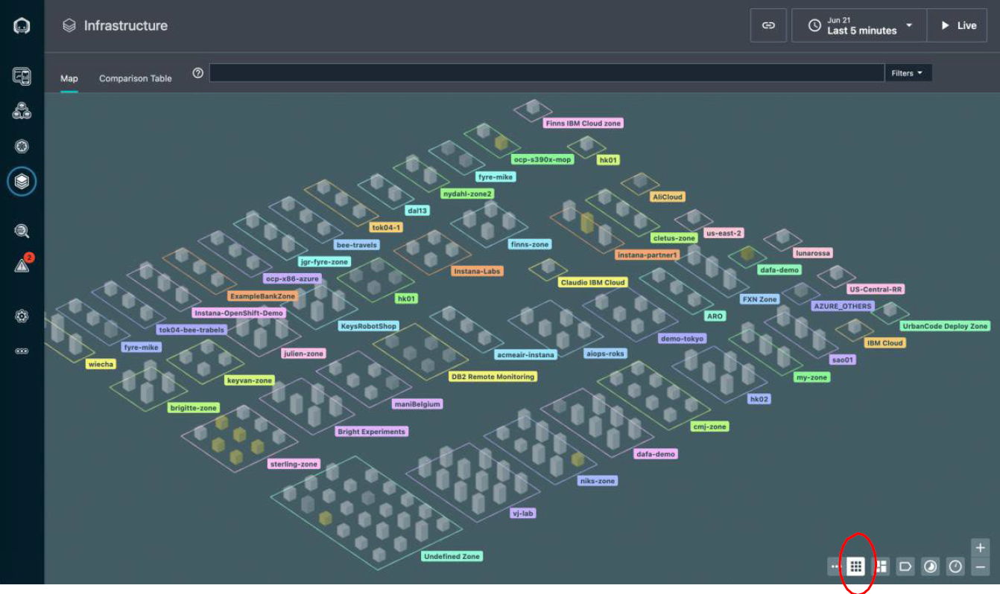
</picture>

Other than the default “Host” perspective, we can switch to “Container”
perspective too. And the grouping has more options, by:

- Zone, which is the default
- OS name
- OS architecture
- Instance type
- CPU model
- CPU count
- And even by tag prefix that comes from custom tags we’ve defined in agents

<picture>
  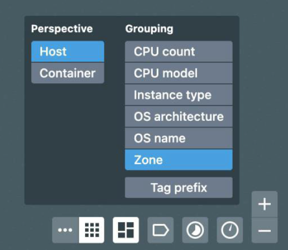
</picture>

This is the view from “Host” perspective and grouping by “OS name”, so we
can group all our infrastructure hosts by OS names:

<picture>
  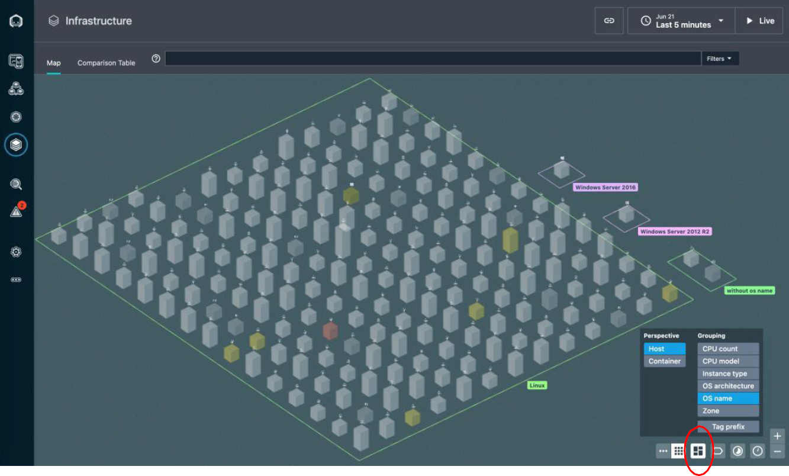
</picture>

This is the view from “Host” perspective and grouping by “CPU model”, so
we can group all our infrastructure hosts by detailed CPU models:

<picture>
  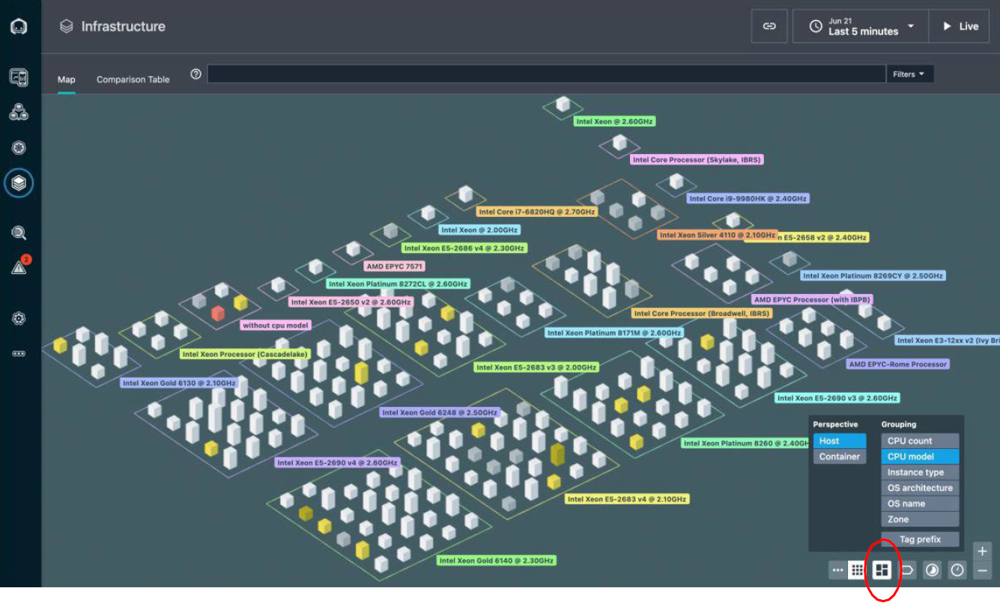
</picture>

Click “Show tags” button can show us all tags within the infrastructure, so having a well-organized tagging system might help us more while monitoring big infrastructure footprint.

<picture>
  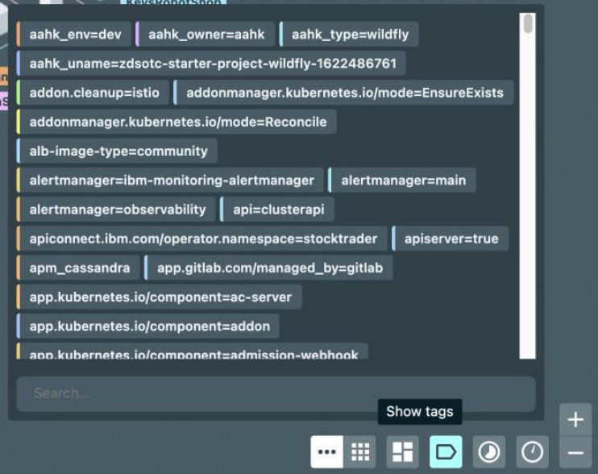
</picture>

Click “Show metrics” button can even show us a view with saturation illustration, which can be from CPU and Memory angle. This gives us a high-level view from overall utilization perspective:

<picture>
  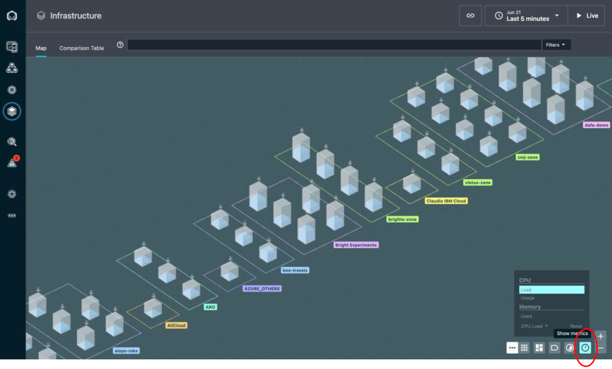
</picture>

2. Comparison Table

The Comparison table makes it easy for you to sort and quickly find the servers and boxes that you would like to look at.

<picture>
  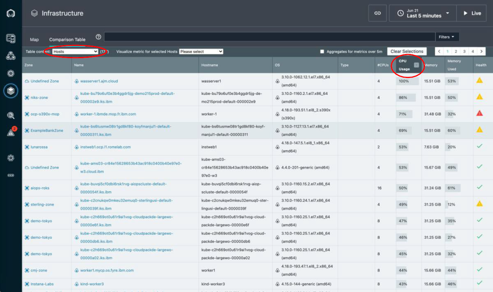
</picture>

The table content can be viewed from different most concerned object types:

<picture>
  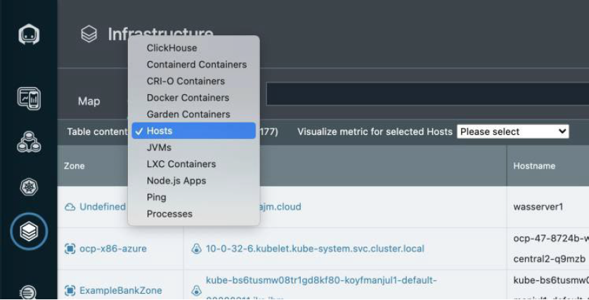
</picture>

We can easily click the header element to sort the table. For example, sorting by “CPU Usage” can see which hosts are consuming most of the CPU percentage:

<picture>
  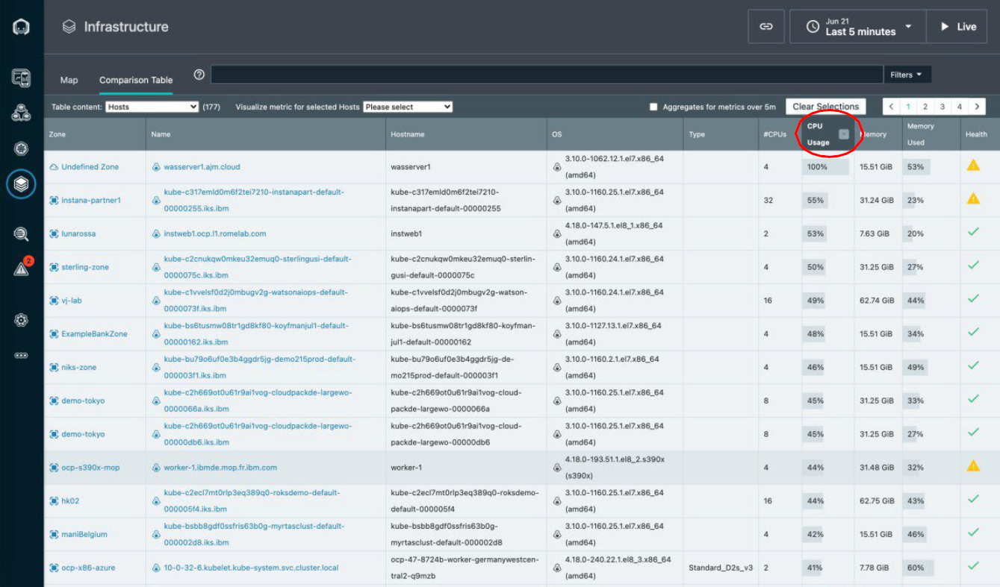
</picture>

And clicking the “Health” can easily find out what hosts are considered not heathy:

<picture>
  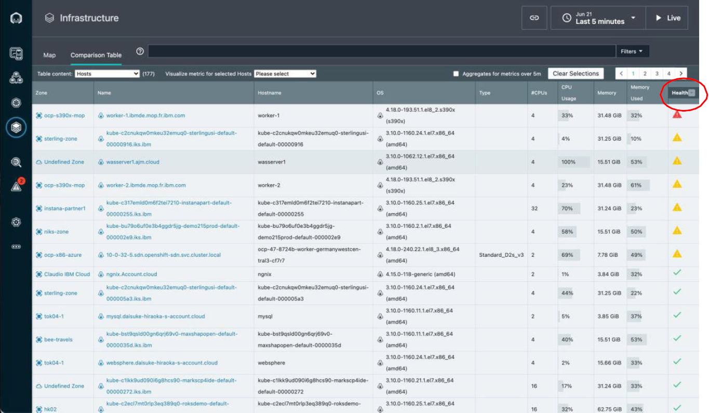
</picture>

We can click one or more rows (not the link), which will be highlighted as white background, and pick the metrics to visualize for a quick and easy analysis for selected objects, in this case they’re hosts. Clicking the “Clear Selections” can quickly clean up what we’ve selected:

<picture>
  
</picture>

3. Instana Dynamic Focus

The filtering system, which is named “Instana Dynamic Focus”, can be used to filter the 3D maps, comparison tables and incident views.

<picture>
  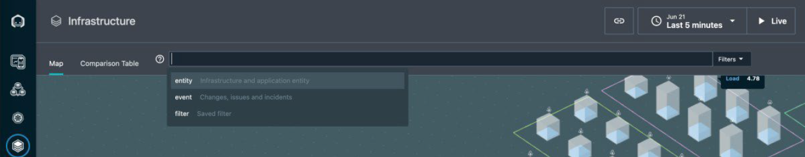
</picture>

The search bar has extensive abilities to search using fuzzy and wildcard searches as well as boolean operators. For example, the following query restricts views to production hosts with less than four CPUs:

```sh
entity.host.cpu.count:<4 AND entity.zone:production
```

Dynamic Focus leverages the Lucene query syntax (https://lucene.apache.org/core/2_9_4/queryparsersyntax.html) with the following differences from the Lucene standard:
- Default operator: AND
- Syntax constraints: are listed in the documentation (https://ibm.biz/BdyjUx)

The search bar supports autocompletion for search fields and will syntax highlight the Lucene query while you type. Once typing, the search bar will propose search fields that match the current input. You can accept proposed fields by hitting RETURN. Hit CTRL+SPACE to open the auto completion popup.

Here can be a Lucene query syntax cheat sheet:

Fielded search
```sh
entity.host.cpu.count:>4
```
Boolean operators
```sh
entity.host.cpu.count:<4 AND entity.zone:production
```
Grouping
```sh
(entity.host.cpu.count:<4 AND entity.zone:production) OR entity.host.cpu.count:>4
```

Wildcard searches 
```sh
entity.type:container*
```

For example, we can easily search and filter out our hosts, by: entity.zone:student\*

<picture>
  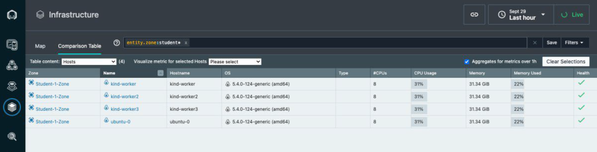
</picture>

4. Monitor Containers

To provide visibility and insight into containerized environments, Instana automatically discovers and monitors Docker containers.
Instana supports many of the widely adopted container runtimes:
- Containerd
- CRI-O
- Docker
- Garden
- Linux Containers (LXC)

Click “Infrastructure” menu item to navigate to Infrastructure view. Key in part of our Zone’s name, e.g. “student”, to filter out the infrastructure and then zoom in to a comfortable size.

<picture>
  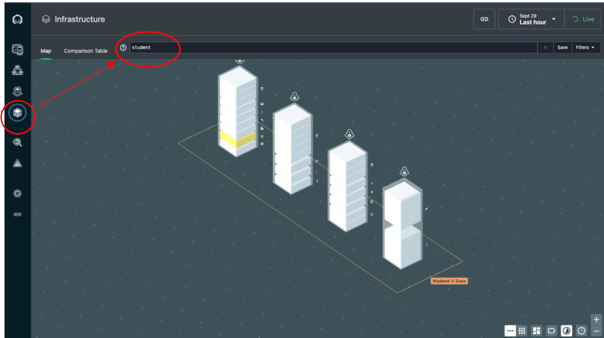
</picture>

There are many layers in the boxes that indicate different discovered technologies.

<picture>
  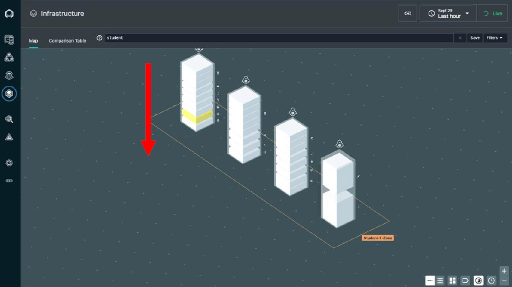
</picture>

We can literarily click any of them. Remember, if the technology is supported, it will be explicitly mentioned otherwise it can be a “normal” containerd container as Kubernetes’s default CRI engine is containerd:

<picture>
  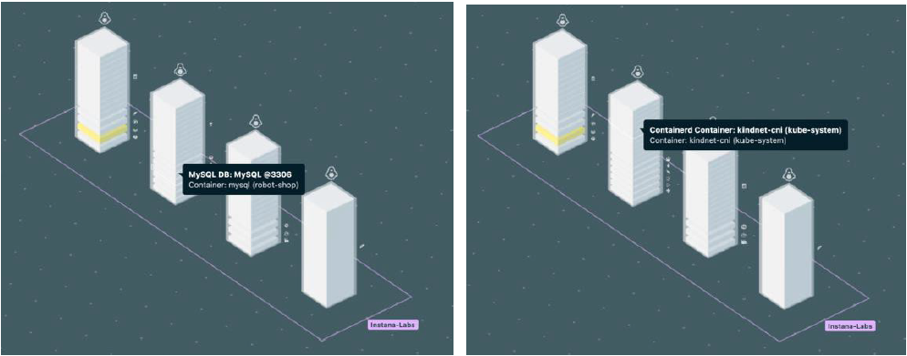
</picture>

Let’s pick an identified container, say “Spring Boot App: shipping service 1.0”
– again, pick whatever you want to explore. Instana will pop up a window to show more info and you may have realized that there are layers of buttons. In this case there are layers of container -> Pod -> Node -> VM Host.

<picture>
  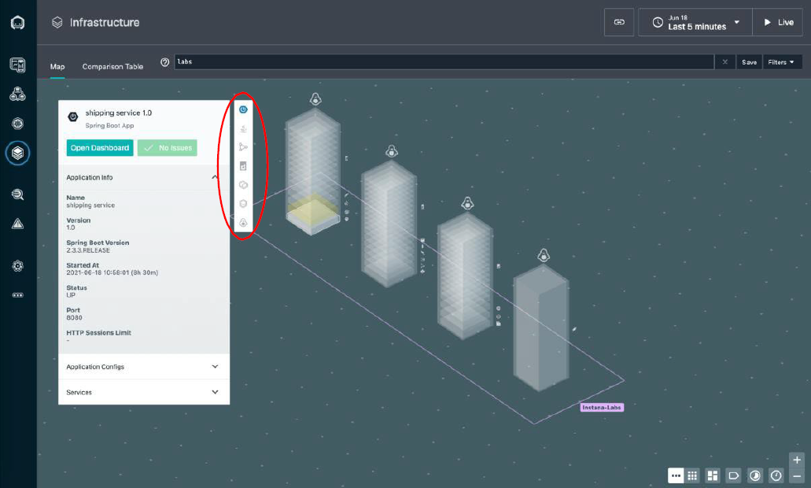
</picture>

Click the “Open Dashboard” button, it will open the responding dashboard:

<picture>
  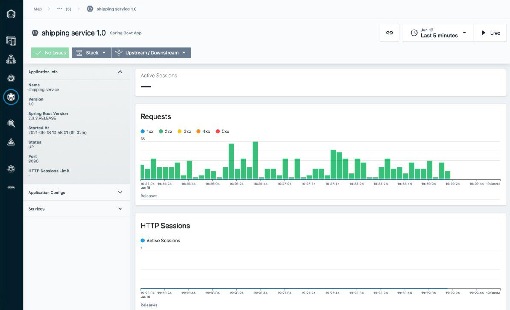
</picture>

We can click browser’s “Back” button, or simply click the “Infrastructure” menu bar gain, it will remember where we were. Now let’s click the “JVM” button to navigate down one more layer. If there is any issue, it will highlight here as well:

<picture>
  
</picture>

Click the “Open Dashboard”, we will see more precise metrics, which are
JVM-oriented ones here, visualized in the responsive dashboard:

<picture>
  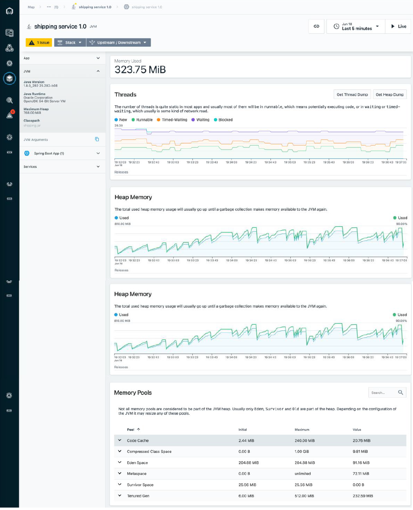
</picture>

So it’s like we’re peeling the onion and you can explore different layers to
see what metrics and insights the built-in dashboards can offer.

5. Navigate through the infrastructure layers

We can navigate through by clicking different layers, all the way down to the host.
Click the process item to view the “Java” process:

<picture>
  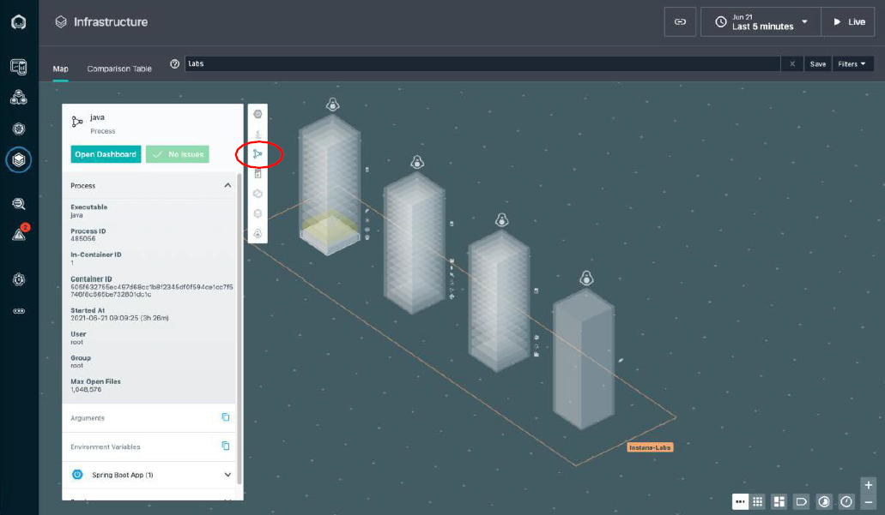
</picture>

Click the “Containerd” icon:

<picture>
  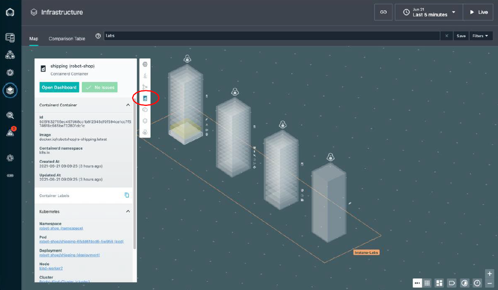
</picture>

Click the “Pod” icon:

<picture>
  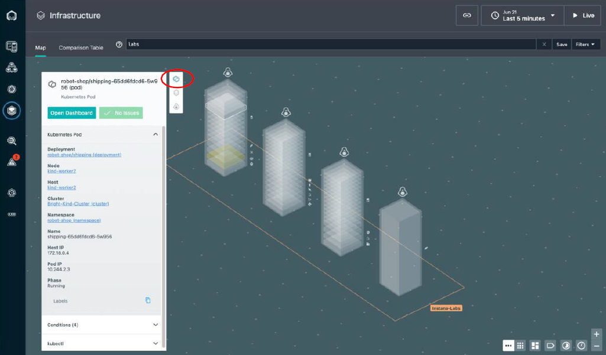
</picture>

Click the “Node” icon:

<picture>
  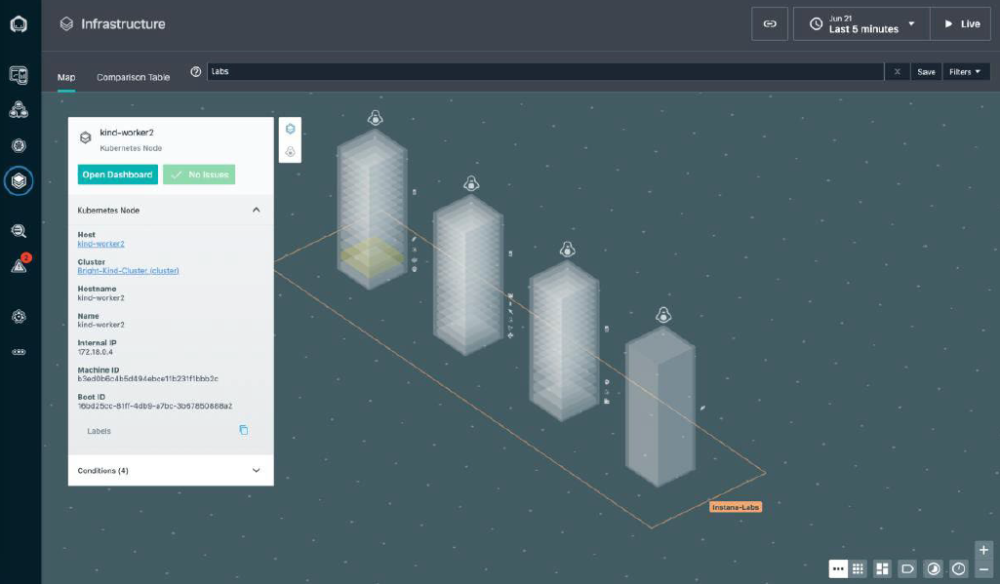
</picture>

Click the “Linux” host icon:

<picture>
  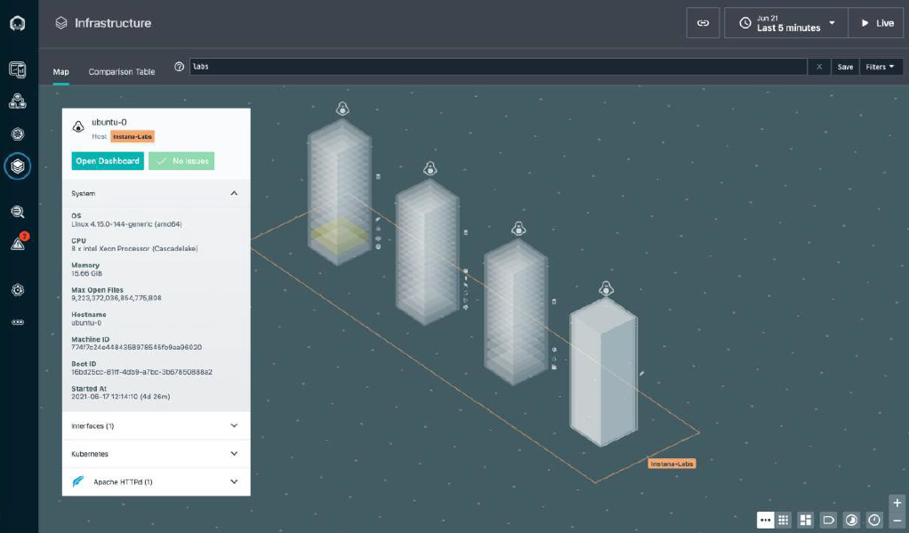
</picture>

Remember, any of the layers will offer a default dashboard with corresponding metrics. For example, we can click the “Open Dashboard” button on above Linux Host’s layer and we will see a series of comprehensive metrics visualized properly for us:

<picture>
  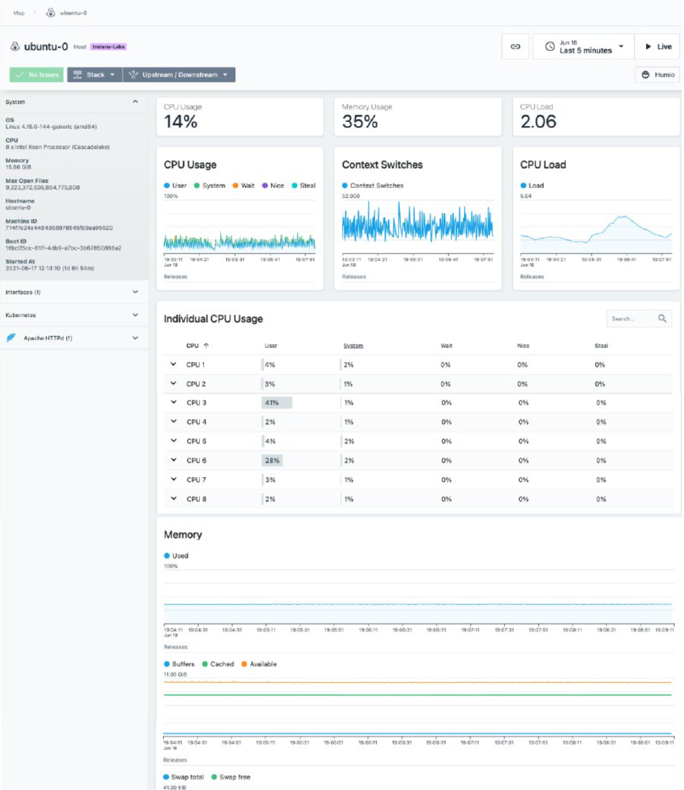
</picture>

And the Instana dynamic graph can still show us more contextual info if you
click the “Stack” and “Upstream/Downstream” button:

<picture>
  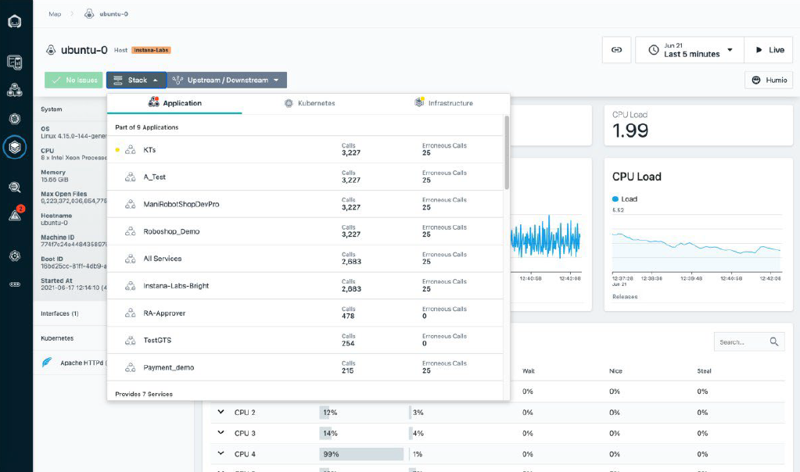
</picture>

**Takeaways**

As you could see from this lab, Instana provides a bird-eye view for the complete infrastructure we’re monitoring where we can easily filter and visualize the objects we care and the performance they’re now on – this gives us an easy way to locate the bottleneck even within a big infrastructure footprint.
With the built-in dynamic graph, we can easily navigate through different layers of technologies within our application stack, be it microservices-based application or traditional one, all the way down to the host. We can dive into each layer to view its dashboard for deeper insights, with complete contextual info on demand.

