# Part 3. Advanced Topics

# Lab 3.1 – Events, analytics and troubleshooting

**Key Concepts**

Event

In Instana, there are 3 types of events: incidents, issues and changes.
- Incidents yield the highest severity level, which are created when edge services accessed by end-users are impacted or there is an imminent risk of impact;

- An Issue is an event that gets created if an application, service or any part of it gets unhealthy.

<picture>
  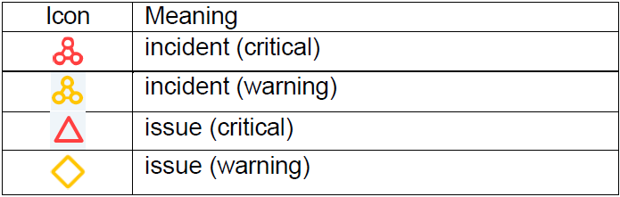
</picture>

Goal

  1. To understand the mechanisms Instana offers for anomaly detection
  2. To walk through a typical troubleshooting process
  3. To understand how to customize Event rules

Steps

1. The mechanisms Instana offers to highlight anomalies

In the landing page of Instana, it will highlight if there are any incidents:

<picture>
  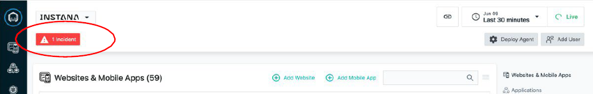
</picture>

On the menu item of “Events”:

<picture>
  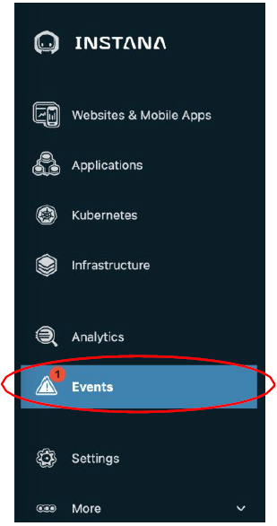
</picture>

Or embedded within the services:

<picture>
  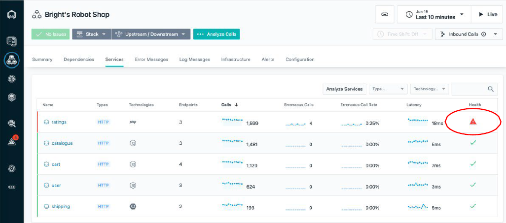
</picture>

Setting up alert rules and alert channels can be a handy way too to stay informed:

<picture>
  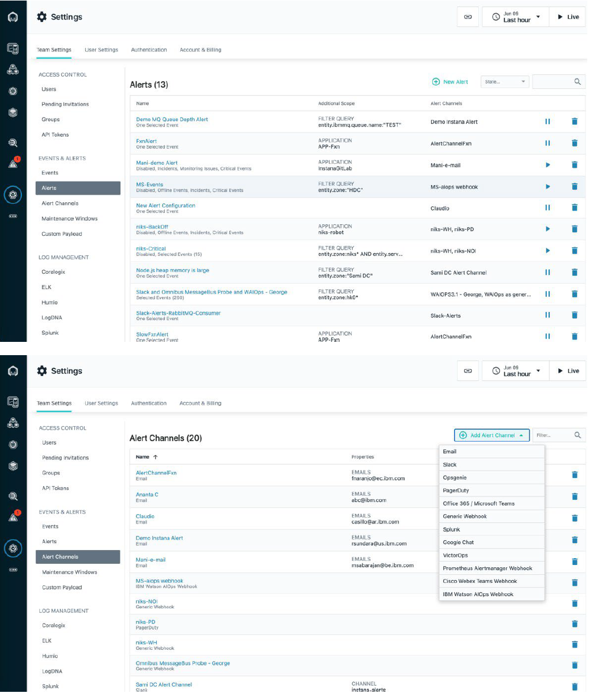
</picture>

2. Explore the Instana Events

We can click the “Events” menu item to see all aggregated events. Default is the incident view:

<picture>
  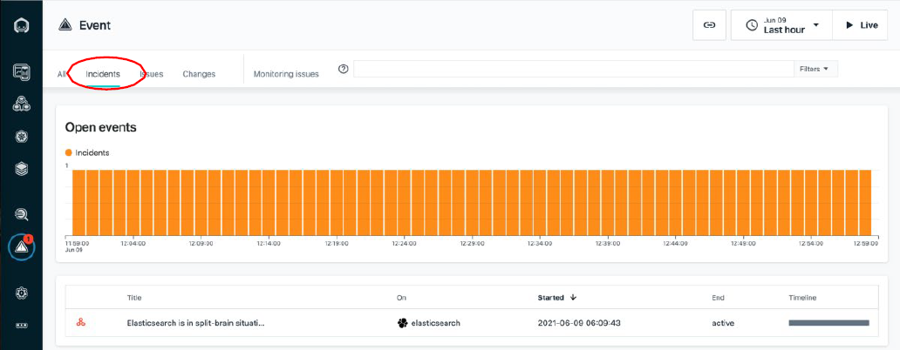
</picture>

If you click the incident, you will see something like this, where it captures all the important correlated elements:

<picture>
  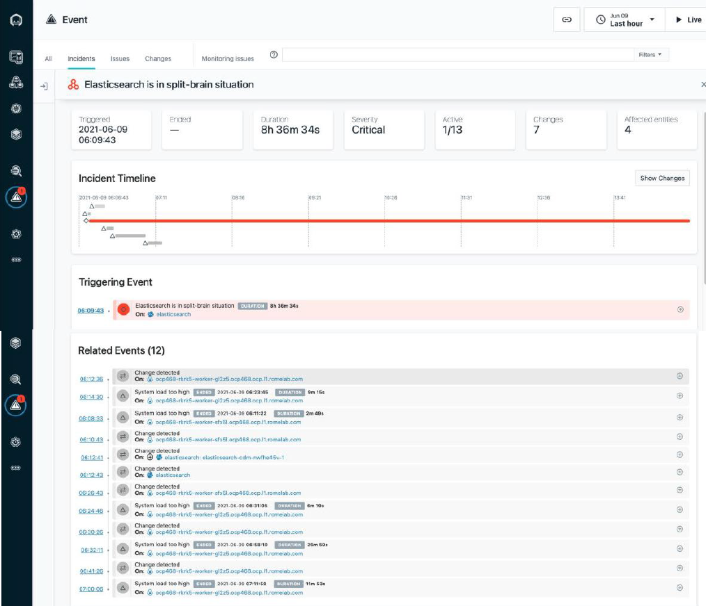
</picture>


Click “All” to see all events from all types:

<picture>
  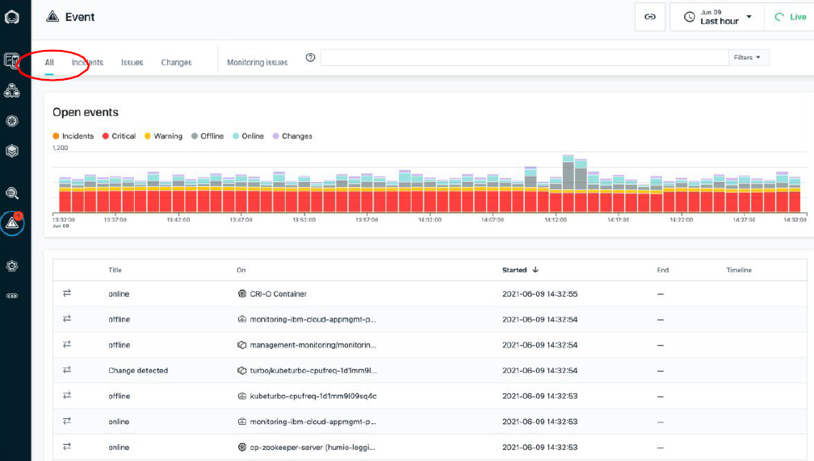
</picture>

Click “Issues” to see issues detected:

<picture>
  
</picture>

Click any of the issues, we can see much more details with evidence too:

<picture>
  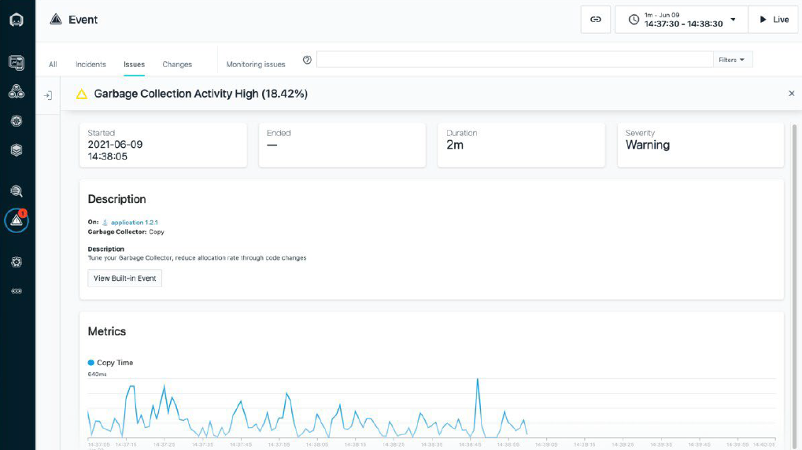
</picture>

Click “Changes” to see changes detected:

<picture>
  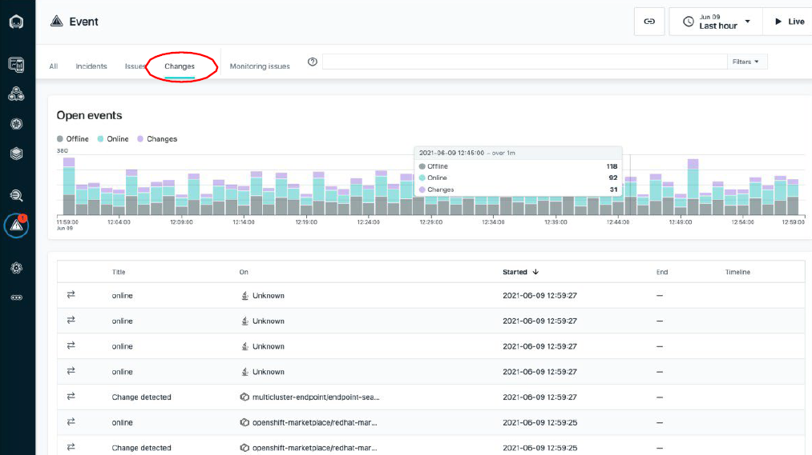
</picture>

Click any of the changes, we can see details like what are changed, and when:

<picture>
  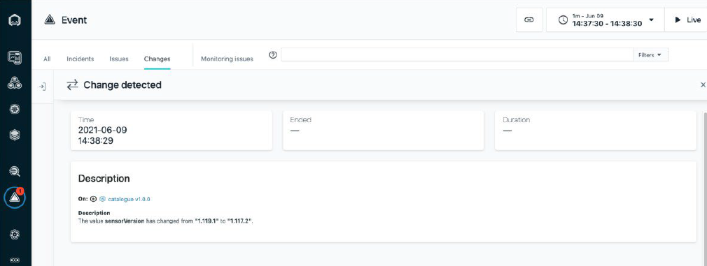
</picture>


3. Browse the built-in event rules

Built-in events are predefined health signatures based on integrated algorithms which help you to understand the health of your monitored system in real-time. There are hundreds of built-in event use cases and rules, please refer to this link for what they are: https://www.ibm.com/docs/en/instana-observability/current?topic=references- built-in-events-reference. Please note that, these built-in event rules not only cover the generic use cases, but also embed a lot of SRE knowledge and practices too for every specific component like public clouds, language runtimes, middleware, databases, etc.

<picture>
  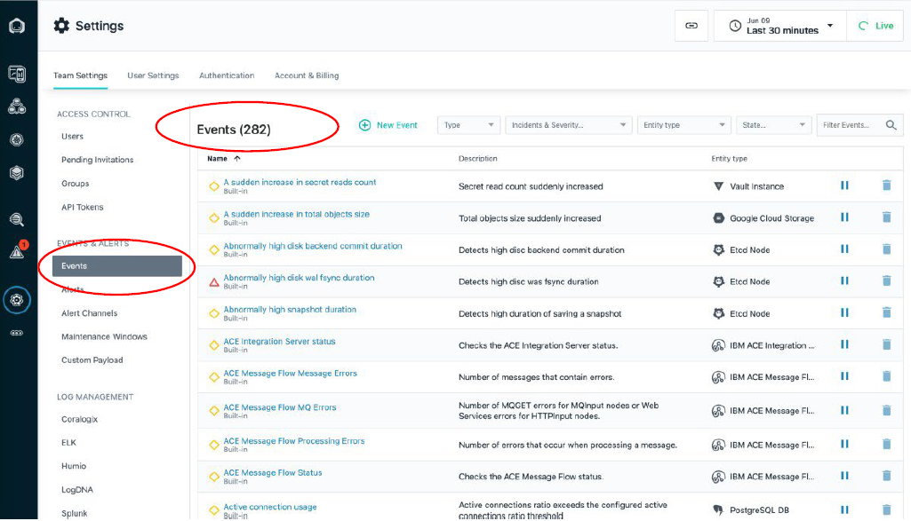
</picture>

4. Let’s purposely “inject” some issues

We can achieve that by updating the “load-gen” we installed in “Lab2 – Website Monitoring”:

Deploy the load-gen App

```sh
$ kubectl -n robot-shop apply -f - <<EOF
apiVersion: apps/v1
kind: Deployment
metadata:
  name: load
  labels:
    service: load
spec:
  replicas: 1
  selector:
    matchLabels:
      service: load
  template:
    metadata:
      labels:
        service: load
    spec:
      containers:
      - name: load
        env:
          - name: HOST
            value: "http://web:8080/"
          - name: NUM_CLIENTS
            value: "5"
          - name: SILENT
            value: "1"
          - name: ERROR
            value: "1"                     # enable it now
        image: robotshop/rs-load:latest
EOF
```
5. Let’s see what Instana has detected

Click the Application icon, filter by our application’s name, and click to open the AP dashboard:

<picture>
  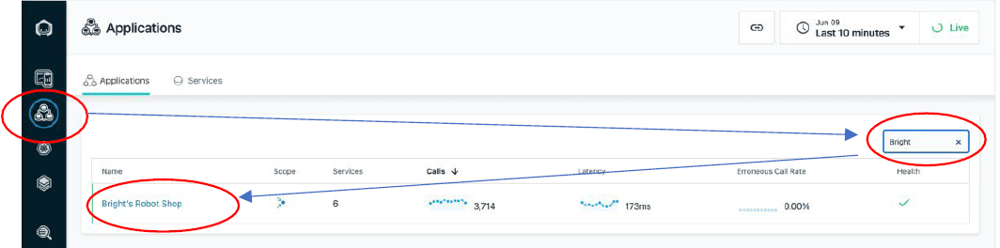
</picture>

We can see the erroneous calls:

<picture>
  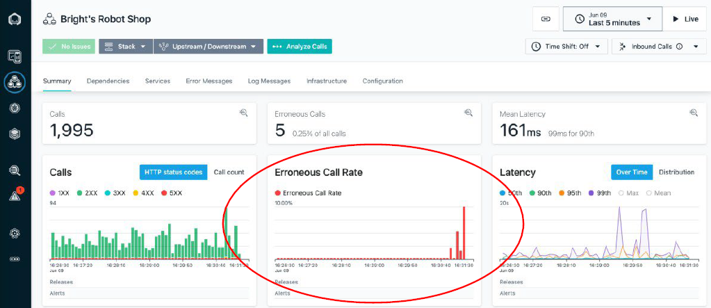
</picture>

And yes, it’s detected – to avoid the noise, you can filter the issues too:

<picture>
  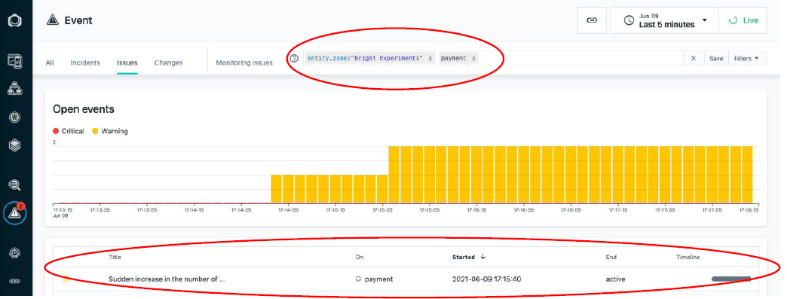
</picture>


Click the issue to see more details:

- The title of “Sudden increase in the number of erroneous calls” is already quite meaningful, with a tag of “SERVICE IMPACT” – yes, this case is service level, the calls to “POST /pay/partner-57” is intentionally erroneous
- There is a start and end time. Since this issue is new and still active, no end time
- The description provides more accurate info: Absolute change: 25%
- The metrics as a way to illustrate the change visually

<picture>
  
</picture>


7. Click to analyze the erroneous calls

It will automatically populate the filter for what we care, and identify that
these issues come from one Endpoint with pattern of “POST /pay/{id}”:

<picture>
  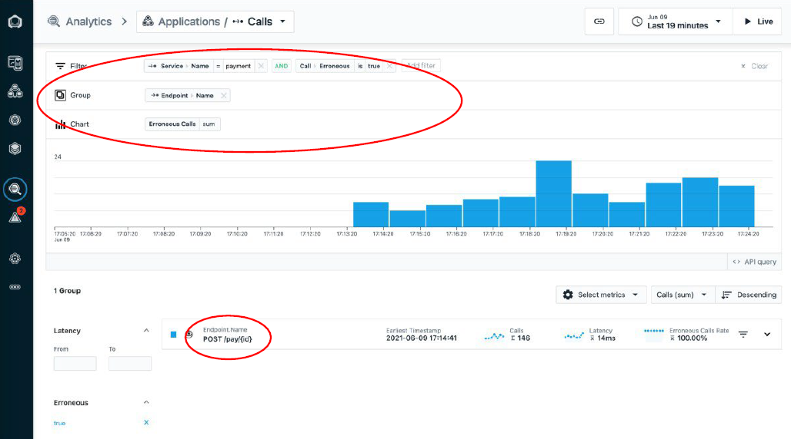
</picture>

Click the Endpoint to list out all erroneous calls – in this case all are “POST /pay/partner-57” from time to time:

<picture>
  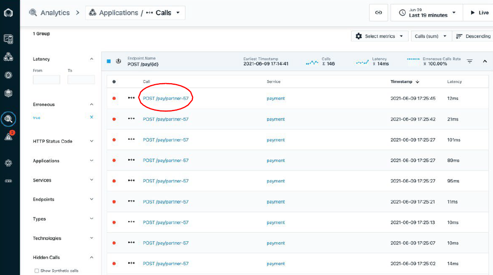
</picture>

Click any of them and we will be redirected to the detailed call analytics, where we can see trace, timeline, service endpoint list, calls and logs as a whole context:

<picture>
  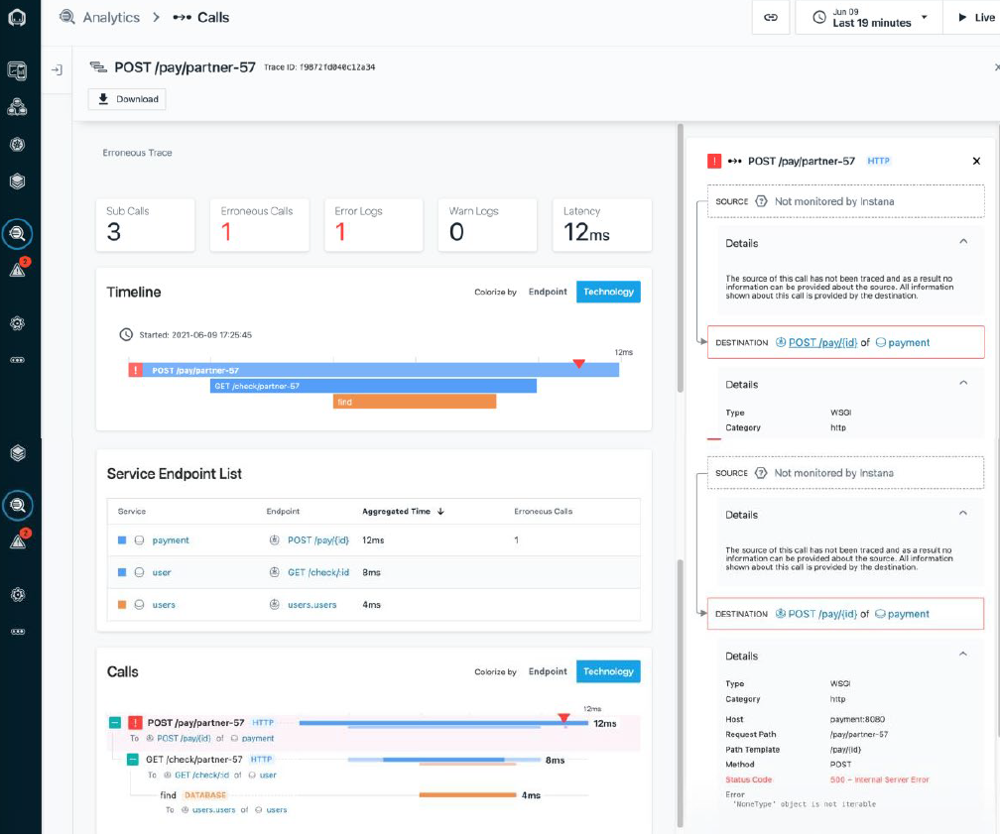
</picture>

From this view, we can clearly see the how these services are interacted and what caused the issue:

<picture>
  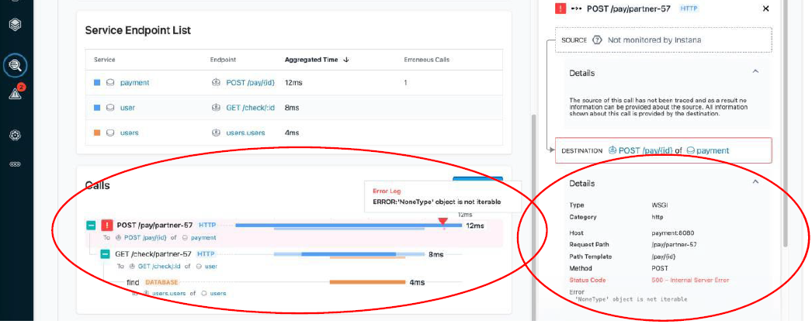
</picture>

From the right side, we even can see the infrastructure underneath, and the stack trace for what exactly caused the issue, if any!

<picture>
  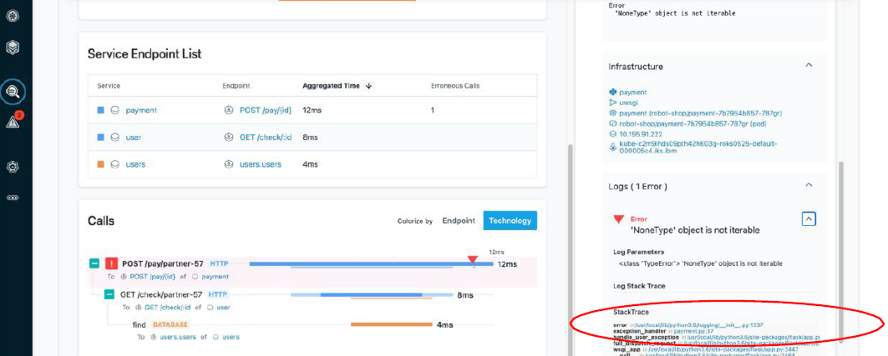
</picture>

For those dynamic programming languages like Java, Python, PHP, Node.js etc., we even can tell “which line of code caused the issue”:

<picture>
  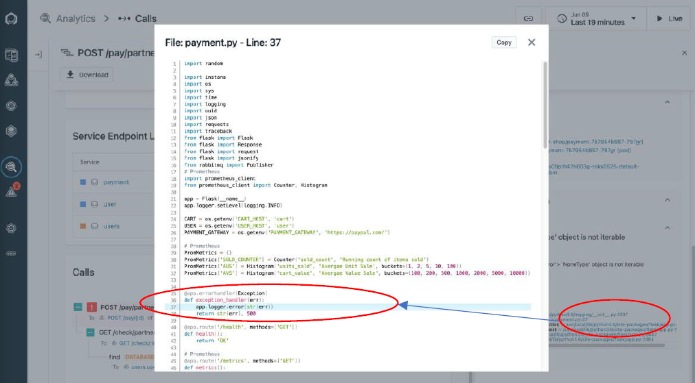
</picture>


8. Figure out how Instana handles event with more findings

If you go back to “Issue” page and filter by the same filters, you might be surprised that the “Issue” might be gone, especially when you select a smaller time window, say “Last 5 minutes”. Why?

If you recall the Event rule that detected the issue, which was “Sudden increase in the number of erroneous calls”, when such erroneous calls become a “new normal”, this rule would have become not true.

Let’s take a deeper look at this Event rule:
- Filter with “built-in” rule, with search keyword of “Sudden increase in erroneous call rate”
- Pick the one with “Service” type


# Lab 3.5 – Custom Metrics (e.g. Cert Expiry Check)

## 1. Enable built-in statsd collector

Let's work in the "manage-to" Host VM.

Firtly, log into the Ubuntu "VM" powered by `footloose`:

```sh
$ footloose ssh root@ubuntu-0 -c footloose.yaml
```

Now, let's work in this Ubuntu "VM":

```
# Enable agent's built-in statsd collector deamon
root@ubuntu-0:~# cat > /opt/instana/agent/etc/instana/configuration-statsd.yaml <<EOF
com.instana.plugin.statsd:
  enabled: true
  ports:
    udp: 8125
    mgmt: 8126
  bind-ip: "0.0.0.0" # all IPs by default
  flush-interval: 10 # in seconds
EOF

root@ubuntu-0:~# netstat -an|grep 8125
```

## 2. Let’s have a quick try

```
root@ubuntu-0:~# apt-get install netcat -y
```

```
root@ubuntu-0:~# echo "hits:1|c" | nc -u -w1 127.0.0.1 8125
root@ubuntu-0:~# echo "custom.metrics.my_metric_name:10|g|#host:ubuntu-0" | nc -u -w1 127.0.0.1 8125
```

## 3. Create a simple script

```
root@ubuntu-0:~# cat > check-tls-cert-expiry.sh <<'EOF'
#!/bin/bash

TARGET="google.com:443";

echo "checking when the certificate of $TARGET expires";

date_cmd="date"
if [[ "$OSTYPE" == "darwin"* ]]; then
    if ! command -v gdate &> /dev/null
    then
        echo "GNU date command is required. You may install it by: brew install coreutils"
        exit
    fi
    date_cmd="gdate"
fi

# Example: Not After : Aug 29 08:29:45 2022 GMT
expiry_date="$( echo | openssl s_client -servername $TARGET -connect $TARGET 2>/dev/null \
                               | openssl x509 -noout -dates \
                               | grep 'notAfter' \
                               | cut -d "=" -f 2 )"
echo "expiry date: $expiry_date"

# Expire in seconds
expire_in_seconds=$( $date_cmd -d "$expiry_date" '+%s' ); 
echo "expire in seconds: $expire_in_seconds"

# Expire in days
expire_in_days=$((($expire_in_seconds-$(date +%s))/86400));
echo "expire in days: $expire_in_days"

# Send the generated metrics to Instana agent
echo "metrics generated: CertExpiresInDays:$expire_in_days|g"
echo "CertExpiresInDays:$expire_in_days|g" | nc -u -w1 127.0.0.1 8125
EOF
```

## 4. Run the script

```
root@ubuntu-0:~# chmod +x check-tls-cert-expiry.sh

root@ubuntu-0:~# while true; do ./check-tls-cert-expiry.sh; sleep 5; done
```

